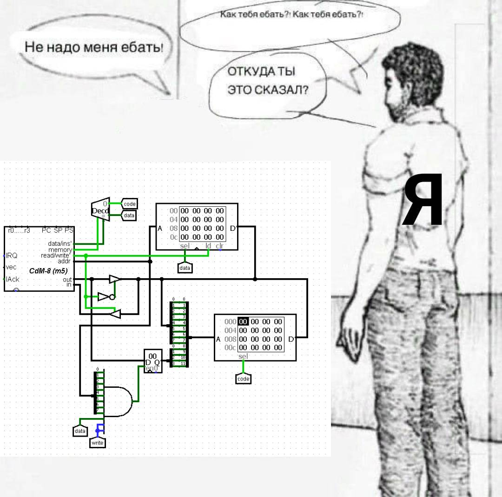
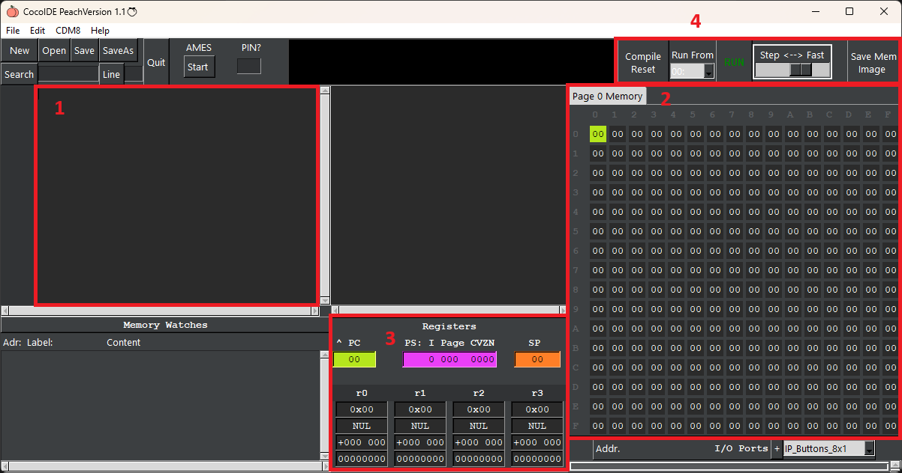
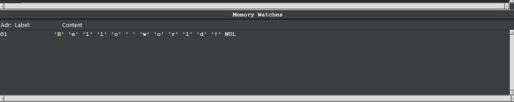

# Гайд по программированию на "ассемблере"

# Введение в душное бубнение

Первое, с чем вы сталкиваетесь на предмете Цифровых платформ - это написание программ на НЕассемблере. Да, язык для cdm-8 не похож на реальный ассемблер, он скорее является обычным императивным языком с элементами ассемблера. И писать код придётся в программе, написанной на python, **Coco**IDE (~~у мужика есть реальные проблемы с кокосами~~).

Вообще это всё потребуется для создания проекта по предмету во втором семестре. В качестве проекта нужно будет создать игру с использованием цифровых электронных схем и процессора cdm-8. Цифра восемь здесь обозначает разрядность процессора. 

💡 Как говорил мой дед-электрик - восемь бит никогда не хватит. Особенно, если биты деревянные.

Да, для создания проекта придётся использовать процессор, и это первая проблема, с которой вы столкнётесь при разработке проекта, как запихнуть кусок текста в этот странный квадратик, и как это запустить. Данному вопрос посвящён другой гайд, но здесь эту тему мы тоже немного затронем.

Итак, у нас есть процессор, он может выполнять некоторые операции с 8-битовыми числами. Однако, **стоит заметить**, что: на данном уровне нет типов для значений, то есть всё есть битовые строки, и то, шестнадцатеричное это число или ASCII-символ, зависит от вас, и как вы эту битовую строку используете. 

Проще говоря - процессору вообще по барабану, что вы там ему даете, он сам не понимает, какой это тип данных. Аналогия: дайте слепому прорабу дрель и попросите сделать дырку (*отверстие*) в ближайшей поверхности. Знает ли, он в какой поверхности будет делать дырку (*отверстие*)? Нет, ему просто нужно выполнить операцию.

До кучи того, процессор может выполнять какие-то операции, но программу он хранить не может, поэтому для его полноценной работы необходимо запоминающее устройство.

💡 Архитектура компьютера - это некое общее описание устройства компьютера, которое показывает как устроена память, адресация, ввод-вывод данных и т.д.

Для нас удобнее всего использовать две архитектуры: фон Неймана или гарвардскую. Основное отличие этих архитектур заключается в способе хранения данных. В архитектуре фон Неймана есть только одно устройство памяти (RAM), в нём хранится и программа, данные и стек, а в Гарвардской архитектуре данные и программа хранятся в разных запоминающих устройствах (ROM - программа и константы, RAM - данные и стек).

💡 Архитектура фон Неймана имеет значительные преимущества, так как можно оперативно перераспределять программы, данные и стэк.

**ОЗУ** (RAM - random access memory) - оперативное запоминающее устройство, память, доступная для записи и чтения, после отключения питания данные с ОЗУ стираются.

Признайся - *захотел(а)* :)

**ПЗУ** (ROM - read only memory) - постоянное запоминающее устройство, память, доступная только для чтения, после отключения питания данные на ПЗУ остаются.

Подчеркну, что это *не то же самое*, что и жесткий диск или SSD, поскольку на них у вас есть возможность **перезаписи**, чего нет на ПЗУ. Вопрос следующий - а зачем это вообще тогда всё нужно? Например, для записи BIOS в матплату - вы если и будете изменять BIOS, то очень редко, поэтому нет смысла оставлять там возможность для перезаписи.

**Шина** - это кабель, состоящий из множества проводников. Количество проводников - максимальная разрядность шины.

Так же удобно использовать данную архитектуру так как шина данных всего одна, и необходимо тянуть меньше проводов, а так же упрощается отладка.
Гарвардская архитектура требует отдельные шины для программ и для данных, а так же из-за использования фиксированного объёма выделенной памяти её использование менее эффективно, чем в архитектуре фон Неймана, но использование разной памяти для данных и для программ увеличивает производительность системы.

Архитектура фон Неймана долгое время была главной в вычислительной технике, однако с развитием микроэлектроники удалось преодолеть недостатки Гарвардской системы, и сейчас она активно используется во внутренней архитектуре современных высокопроизводительных процессоров, где кэш-память разбивается на память данных и программ.

Какую архитектуру использовать решать вам. В том ПО, которое у вас будет, плюсы и минусы данных архитектур влияют на проект незначительно.
Мы будем рассматривать написание кода для архитектуры фон Неймана.

# Рассматриваем программу

Для начала нужно скачать python, так как программа написана на нём, и не собрана в exe-файл. Скачиваем версию 3 и выше, потом скачиваем и разархивируем cocoIDE (здесь вы можете выбрать, либо стандартная версия со светлой темой, либо кастомизированная с тёмной темой). Далее нужно зайти в папку программы и запустить файл с расширением *.pyw. У вас запустится окно программы.

1 - поле редактирования кода; 2 - память; 3 - регистры и флаги состояний, PC и SP; 4 - кнопки компиляции и отладки программы;

Помимо важных частей интерфейса есть второстепенные. Ниже поле редактирования текста находится окно просмотра адреса, и того, что по нему записано, это окно нам пригодится позже. Над зоной 3 находится окно, показывающее программу в машинном коде, т.е. адрес команды в памяти код команды и прочее.

Теперь обратно к основным элементам. С 1 всё понятно, просто текстовое поле, в котором пишется код. Со 2 уже интереснее, т.к. мы рассматриваем архитектуру фон Неймана, то в этой памяти у нас и будет хранится скомпилированный код, данные и стек. Сама память представлена в виде таблицы, где у каждой ячейки есть её адрес в виде шестнадцатеричного числа, где строка - первая шестнадцатеричная цифра и столбец - вторая шестнадцатеричная цифра. При этом если перевести этот адрес в десятичное число, то будет ясно видно, что память на самом деле строка длины 256 байт. В каждой ячейке лежит 8-битная строка, и она же отображается в шестнадцатеричном виде на каждой ячейке, если навести мышку на ячейку, то можно увидеть значения данной строки в следующих типах: шестнадцатеричный, ASCII-символ, знаковое и беззнаковое десятичные числа, двоичное представление. Ячейка, с которой происходит работа, подсвечивается.

Далее, под цифрой 3 расположились их высочества регистры и некоторые другие приколы.

- **PC** (Program counter) - хранит адрес следующей инструкции, не может быть изменён напрямую.
- **SP** (Stack pointer) - указатель стека, хранит адрес последнего элемента в стеке, стек растёт с конца памяти, поэтому первый элемент будет записан по адресу 0xFF, второй в 0xFE и т.д. Меняется при взаимодействии со стеком.
- **PS** (Processor status register) - регистр, хранящий некоторые состояния: на первые 4 бита PS можете забить, оно никак не используется, точнее это можно использовать, но нам это пока не надо, и вряд ли потребуется (для интересующихся: первые 4 бита связаны с прерываниями), а вот следующие 4 бита очень важны, они хранят метаданные (данные о данных), подробнее мы их рассмотрим в разделе команд.

Ниже находятся 4 **GP** (General purpose registers) - регистры общего назначения, по сути единственные 4 переменные, которые можно менять обращаясь сразу к ним без адреса и танцев с бубном. Каждый регистр отображается в тех же форматах, как и при просмотре памяти.

Под цифрой 4 расположились кнопки отладки. Вот они слева направо: Compile/Reset - нажимается всегда, перед запуском программы, компилирует код и перезапускает его; Run from - странная штука, по идее указывает адрес, с которого запускать программу, но никак не используется. забейте; Большая кнопка RUN, запускает откомпилированную программу; Скорость работы программы, параметр для отладки, самая маленькая скорость - пошаговая, каждая новая инструкция запускается после нажатия кнопки RUN; Последняя кнопка сохраняет образ памяти для загрузки в ПЗУ в Logisim, потребуется вам при работе с процессором для проекта.

В правом нижнем углу находится поле для добавления IO компонентов по типу кнопок, дисплеев и т.д. Данная часть программы очень забагованая, поэтому использовать их не рекомендую. Ну и они вам не потребуются при работе с задачками почтового робота, а при работе с процессором всё равно вы скорее всего сделаете что-то удобное именно вам.

# Команды

> Это простой список инструкция, с кратким описанием. Так сказать шпора по инструкциям.
> 

Как и обещал, для начала кратко о младших 4 битах PS.

- Z - означает, что число равно нулю
- N - по сути отображает 7 бит строки, если 1, то число отрицательное, если 0, тогда положительное
- C - бит переноса (беззнакового переполнения), поднимается, если при выполнении какой-то операции необходимо поместить какой-то бит на место 8го или -1го бита результата, а такие биты размером данных не предусмотрены.
- V - бит знакового переполнения. Условие для поднятие бита переполнения простое: он поднимается, если знак результата отличается от ожидаемого. Например: Мы пытаемся сложить два положительных числа, а получаем отрицательное (0b01000000(64) + 0b01000000(64) = 0b10000000(-128) в результате получилось отрицательное число, хотя ожидалось положительное. Бит V будет поднят).

- **Арифметико-логические операции**
    
    
    | Команда | Формула | CVZN | Описание |
    | --- | --- | --- | --- |
    | **add** rn, rm | rm = rm + rn | CV - по операции   ZN - по результату | Добавляет число из **rn** к **rm** и записывает результат в **rm**. |
    | **addc** rn, rm | rm = rm + rn + C | CV - по операции   ZN - по результату | Добавляет число из **rn** к **rm** и прибавляет бит C записывает результат в **rm**. |
    | **sub** rn, rm | rm = rn - rm | CV - по операции   ZN - по результату | Вычитает из **rn** **rm** и записывает результат в **rm**. |
    | **neg** rn | rn = -rn | CV - по операции   ZN - по результату | Меняет знак на противоположный. |
    | **inc** rn | rn = rn + 1 | CV - по операции   ZN - по результату | Прибавляет 1 |
    | **dec** rn | rn = rn - 1 | CV - по операции   ZN - по результату | Вычитает 1 |
    | **clr** rn | rn = 0 | C=1   V=0   Z=1   N=0 | Обнуляет значение в регистре |
    | **cmp** rn, rm | rn - rm | CV - по операции   ZN - по результату | Вычитает из rn rm без изменения значений регистров, необходим для обновления метаданных. |
    | **tst** rn, rm | - | CV=0   ZN - по результату | Устанавливает флаги для получения метаданных числа. |

- **Побитовые операции**
    
    
    | Команда | Формула | CVZN | Описание |
    | --- | --- | --- | --- |
    | **and** rn, rm | rm = rm ⋀ rn | CV=0   ZN - по результату | Побитовая операция **И** |
    | **or** rn, rm | rm = rm ⋁ rn | CV=0   ZN - по результату | Побитовая операция **ИЛИ** |
    | **xor** rn, rm | rm = rn ⊕ rm | CV=0   ZN - по результату | Побитовая операция исключающего **ИЛИ** |
    | **not** rn | rn = ¬rn | CV=0   ZN - по результату | Побитовая операция **НЕ (инвертирование)** |

- **Сдвиги**
    
    В данном случае запись **A** <<(>>) *const* обозначает, что значение слева от сдвигается, при этом *const* задвигается на освободившееся место.
    
    | Команда | Формула | CVZN | Описание |
    | --- | --- | --- | --- |
    | **shla** rn | rn = rn << 0 (rn × 2) | C = 7 бит   V = 1 если 7 бит изменился   ZN - по результату | Сдвиг влево с подстановкой 0 справа, эквивалент умножения на 2 |
    | **shra** rn | rn = rn >> 0 (rn ÷ 2) | C = 0 бит   V = 0   ZN - по результату | Сдвиг вправо с подстановкой 0 слева, эквивалент целочисленного деления на 2 (в таком случае C - остаток) |
    | **shl** rn | rn = rn << C | C = 7 бит   V = 1 если 7 бит   ZN - по результату | Сдвиг влево, старое значение C задвигается справа |
    | **shr** rn | rn = rn >> C | C = 0 бит   V = 0   ZN - по результату | Сдвиг вправо, старое значение  C задвигается слева |
    | **rol** rn | rn = rn << rn.b7 | CV = 0   ZN - по результату | Цикличный сдвиг влево, т.е. 7 бит задвигается на место 0го бита |

- **Операторы сравнения**
    
    
    | Оператор | Формула | Значение |
    | --- | --- | --- |
    | eq/z | Z | = или is Z |
    | ne/nz | ¬Z | ≠ или is not Z |
    | hs/cs | C | ≥(беззнаковое) или is C |
    | lo/cc | ¬C | <(беззнаковое) или is not C |
    | mi/pl | N / ¬N | <0 или ≥0 |
    | vs/vc | V / ¬V | is V или is not V |
    | hi | C ⋀ ¬Z | >(беззнаковое) |
    | ls | ¬C ⋁ Z | ≤(беззнаковое) |
    | ge | ¬(N ⊕ V) | ≥, ≥0 |
    | lt | N ⊕ V | <, <0 |
    | gt | ¬Z ⋀ ¬(N ⊕ V) | >, >0 |
    | le | Z ⋁ (N ⊕ V) | ≤, ≤0 |

- **Ветвление**
    
    
    | Оператор | Описание |
    | --- | --- |
    | br *const* | Копирует *const* в PC |
    | bz/beq *const* | Копирует *const* в PC, если выполнено условие z/eq |
    | bnz/bne *const* | Копирует *const* в PC, если выполнено условие nz/ne |
    | blt *const* | Копирует *const* в PC, если выполнено условие lt |
    | ble *const* | Копирует *const* в PC, если выполнено условие le |
    | bgt *const* | Копирует *const* в PC, если выполнено условие gt |
    | bge *const* | Копирует *const* в PC, если выполнено условие ge |
    
    Все операторы ветвления копируют константное значение в PC, где *const* - это адрес инструкции, к которой следует перейти. Сюда же можно отнести инструкцию **jsr** *const*, однако эта инструкция затрагивает стек, а именно при вызове джампера PC помещается в стек, после чего *const* помещается в PC, а при завершении подпрограммы необходимо вызвать **rts**, которая вернёт значение с вершины стека в PC. Поэтому при реализации подпрограмм на **jsr** необходимо быть аккуратным с использованием стека.
    
- **Работа с памятью и стеком**
    
    
    | Команда | Описание |
    | --- | --- |
    | ldi rn, *const* | Записывает константное значение в **rn**:   - десятичный формат обычный (65)   - ASCII-символ записывается в двойных кавычках (”A”)   - двоичный код вписывается через 0b… (0b01000001)   - шестнадцатеричное число вписывается через 0x… (0x41) |
    | ld rn, rm | Считывает значение из RAM в **rm** по адресу **rn** |
    | ldc rn, rm | Считывает значение из ROM в **rm** по адресу **rn**:   - В архитектуре фон Неймана используется **ld**, т.к. там только одна общая RAM   - В Гарвардской архитектуре **ld** будет считывать данные из RAM, а **ldc** из ROM, т.е. **ldc** используется для получения констант из памяти. |
    | st rn, rm | Сохраняет значение  из **rm** в RAM по адресу из **rn** |
    | move rn, rm | Копирует значение из **rn** в **rm** (CV = 0, а ZN - по результату в **rm**) |
    | push rn | Помещает значение из **rn** на вершину стека |
    | pop rn | Достаёт значение с вершины стека в **rn** |
    | ldsp rn | Загружает значение из SP в **rn** |
    | stsp rn | Загружает **rn** в SP (Использовать очень осторожно!) |
    | dc *const values* | Помещает значения в ROM при компиляции программы |
    | ds *const* | Выделяет область памяти в RAM, где *const* - количество байт для резервирования |

- **Циклы и условный оператор**
    
    Стандартный условный оператор имеет следующий синтаксис (можно использовать без **else**):
    
    > **if**
         …установка флагов
      **is** условие
        …действие, если условие выполнено
      **else**
        …действие в противном случае
      **fi**
    
    Помимо этого можно описывать более сложные условия (можно использовать без **else**):
    
    > **if**
         #установка флагов для первого условия
     **is** условие 1, **and**
         #установка флагов для второго условия
     **is** условие 2, **and**
     ….
     **is** условие n
     **then**
         #действие, если все условия выполнены
     **else**
         #действие в противном случае
     **fi** 
    
    Стандартный синтаксис цикла:
    
    > **while**
         #установка флагов
      **stays** условие
         #действие
      **wend**
    
    Цикл с постусловием:
    
    > **do**
         #действие
         #установка флагов
     **until** условие

- **Прочее**
    
    - **asect** *const* - указывает адрес, начиная с которого необходимо располагать код, находящийся ниже инструкции
    - **end** - указывает конец компилируемой программы, всё что будет записано ниже не будет размещено в памяти
    - **halt** - прекращает выполнение программы на совсем (если её вызвать на процессоре поможет только хард-резет, что не очень хорошо, и не очень удобно)
    - **wait** - выполнение программы останавливается на этой инструкции до получения сигнала о прерывании (не используйте эту инструкцию при отладке программы в cocoIDE, т.к. нет способа выйти из ожидания)
    

# Примеры написания кода и использования инструкций

Итак, пришло время писать код. И первый вопрос… А как? В местном НЕассемблере нельзя просто взять и начать писать код как в python, здесь нет функции main как в C-подобных языках, здесь есть свои приколы.

Любая программа в coco должна начинаться с команды **asect** *const*, и заканчиваться **end**. Со вторым всё понятно, она обозначает точку конца программы, то есть весь код ниже **end** не будет размещён в памяти.  Оставляем её где-то внизу и идём дальше. **asect** же более интересен, **asect** указывает адрес, с которого следующий участок кода будет хранится в памяти, то есть запись **asect** 0xe0 обозначает, что код ниже этой записи будет хранится в памяти начиная с адреса e0. Тогда имеем следующий шаблон:

> **asect** 0x00 
     #код здесь
     **halt**
 **end**
> 

А откуда взялось **halt**? Эта инструкция прерывает выполнение программы. Дело в том, что после запуска программы, память будет перебираться бесконечно, и **halt** останавливает этот процесс. Можете убрать **halt** и посмотреть, что получится.

Ну вот у нас есть шаблон кода, дольше по канону требуется написать программу, которая выводит “Hallo world!”. Но у нас нет консолей, поэтому нам ничего не остаётся, кроме как записать эту строку в память. И проще всего это сделать с помощью инструкции **dc**, которая размещает всё что записано после неё в памяти. Пишем следующий код:

> **asect** 0x00
  
      #…
  
      **halt**
  
  INPUTS:
      **dc** "Hello world!", 0
  
  **end**

Итак, вот мы скомпилировали этот код, ну и где строка? Посмотреть, где в памяти расположена наша строка, мы можем в окошке под полем редактирования кода. Выглядеть это будет как-то так:

Здесь записан адрес первой ячейки памяти, потом метка данного участка памяти (это далее), и сохранённые данные. И если вы наведёте курсор на ячейку памяти с адресом, указанном в Adr, то вы должны увидеть символ “H”.

Теперь рассмотрим код построчно. Здесь мы дописали в шаблон метку INPUTS, мы это сделали для удобства, но вообще метка хранит адрес, с которого начинается код ниже метки, далее мы рассмотрим как эти метки использовать для обращения к памяти. Ниже при помощи **dc** мы записали строку в память, а 0 в конце строки используется как обозначение конца строки, что будет полезно при работе со строками.

Давайте расширим код, добавив метки для двух байт **a** и **b**, и переметим константы в область памяти e0:

> **asect** 0x00
     #…
     **halt**
 
 INPUTS:
     **asect** 0xe0
     a: dc 2
     b: **dc** 5
 **end**

Теперь попробуем математические операции с числами:

> **asect** 0x00
     **ldi** r0, 5
     **ldi** r1, 3
     **add** r0, r1
     **halt**
 
 INPUTS:
     **asect** 0xe0
     a: **dc** 2
     b: **dc** 5
 **end**

Сначала мы загружаем в r0 и r1 числа 5 и 3, соответственно. Потом при помощи инструкции **add** прибавляем r0 к r1, в r1 получится 8.

Но задавать значения таким образом неудобно, т.к. если нам придётся использовать эти значения где-то ещё, то нам придётся менять все значения в коде, поэтому было бы хорошо, если бы мы могли забирать эти значения откуда-то ещё. Для этого мы и добавили метки **a** и **b**. Теперь эти метки хранят адреса памяти, где лежат числа 2 и 5. Добавим в код использование меток:

> **asect** 0x00
     **ldi** r0, a
     **ld** r0, r0
     **ldi** r1, b
     **ld** r1, r1
 
     **add** r0, r1
 
     **halt**
 
 INPUTS:
     **asect** 0xe0
     a: **dc** 2
     b: **dc** 5
 **end**

В данном коде мы сначала загружаем в r0 адрес константы **a**, а потом при помощи инструкции **ld** достаём значение по этому адресу и помещаем его в r0 вместо адреса. С регистром r1 и константой **b** поступаем аналогично. И в конце складываем числа.

Вот у нас получилось какое-то значение, хорошо бы его тоже занести в память, чтобы освободить регистры, и чтобы в дальнейшем, при разработке проекта, нам было удобно передавать результат периферии. Далее переместим входные метки по адресу d0 и выделим один байт для ответа и пометим адрес этого байта в метку **res**:

> **asect** 0x00
     **ldi** r0, a
     **ld** r0, r0
     **ldi** r1, b
     **ld** r1, r1
    
     **add** r0, r1
     **ldi** r2, res
     **st** r2, r1
 
     **halt**
 
 INPUTS:
     **asect** 0xd0
     a: **dc** 2
     b: **dc** 5
 OUTPUTS:
     **asect** 0xe0
     res: **ds** 1
 
 **end**

После выполнения кода, в ячейке по адресу e0 появится значение 7.

Когда суммирование выполнено, загружаем в r2 адрес байта для ответа, после чего при помощи инструкции **st** сохраняем значение из r1 по адресу из r2.

Теперь разберёмся с условным оператором, давайте будем выводить модуль суммы, для этого нам нужна проверка знака, если число отрицательное, то мы будем менять ему знак на противоположный:

> **asect** 0x00
     **ldi** r0, a
     **ld** r0, r0
     **ldi** r1, b
     **ld** r1, r1
 
     **add** r0, r1
     **if**
         **tst** r1
     **is** mi
         **neg** r1
     **fi**
     **ldi** r2, res
    **st** r2, r1
 
     **halt**
 INPUTS:
     **asect** 0xd0
     a: **dc** 2
     b: **dc** 5
 OUTPUTS:
     **asect** 0xe0
     res: **ds** 1
 **end**

После выполнения суммы проверяем результат, если число меньше 0, то делаем его положительным.

Теперь давайте рассмотрим списки и циклы. Вы уже знаете, что память - это длинная строка байт, следовательно, если мы знаем адрес первого элемента списка каких-то элементов, то мы можем получить любой другой элемент списка, просто прибавив к адресу первого элемента индекс искомого. Давайте перепишем наш сумматор, так, чтобы наши два числа были в виде списка из двух элементов:

> **asect** 0x00
     **ldi** r3, data
     **ld** r3, r0
     **inc** r3
     **ld** r3, r1
 
     **add** r0, r1
     **ldi** r2, res
     **st** r2, r1
 
     **halt**
 
 INPUTS:
     **asect** 0xd0
     data: **dc** 2, 5
 OUTPUTS:
     **asect** 0xe0
    res: **ds** 1
 **end**

Во-первых, мы переписали **a** и **b** под общую метку **data**. Во-вторых, заменили чтение данных из памяти, мы сначала сохраняем адрес значений в r3, потом по этому адресу достаём значение, и помещаем его в r0, после чего увеличиваем r3 на единицу, тем самым получая адрес следующей ячейки памяти, и выгружаем значение оттуда в r1.

Теперь мы можем сделать сумматор для списков большего размера, для этого дополнительно создадим метку **n** с количеством элементов в списке:

> **asect** 0x00
 
     **ldi** r3, n
     **ld** r3, r2
     **ldi** r3, data
 
     **while**
         **tst** r2
     **stays** pl
         **ld** r3, r0
         **add** r0, r1
         **inc** r3
         **dec** r2
     **wend**
     
     **ldi** r2, res
     **st** r2, r1
 
     **halt**
 INPUTS:
     **asect** 0x90
     n: **dc** 5
     data: **dc 1,** 2, 3, 4, 5
 OUTPUTS:
     **asect** 0xe0
     res: **ds** 1
 **end**

Здесь мы сначала загружаем в r2 количество элементов в списке, затем, пока r2 ≥ 0 мы выгружаем очередное число из списка в r0 и прибавляем его к результату в  r1. В конце тела цикла увеличиваем адрес элемента на 1, а r2, наоборот уменьшаем на 1, т.к. ещё один элемент рассмотрен.

Ну и под конец давайте вынесем часть с циклом в подпрограмму с использованием **jsr**:

> **asect** 0x00
 
     **ldi** r3, n
     **ld** r3, r2
     **ldi** r3, data
 
     **jsr** sum
     
     **ldi** r2, res
     **st** r2, r1
 
     **halt**
 
     **sum**:
         **while**
             **tst** r2
         **stays** pl
             **ld** r3, r0
             **add** r0, r1
             **inc** r3
             **dec** r2
         **wend**
         **rts**
 
 INPUTS:
     **asect** 0x90
     n: **dc** 5
     data: **dc 1,** 2, 3, 4, 5
 OUTPUTS:
     **asect** 0xe0
     res: **ds** 1
  **end**

Для подпрограммы мы объявили метку **sum** и перенесли туда суммирующий цикл. Подпрограмма вынесена за **halt**, т.к. если оставить её до этой инструкции, то содержимое подпрограммы будет выполнено, а нам этого не надо. Для запуска подпрограммы используем **jsr**, а для выхода из подпрограммы **rts**.
И чтобы разобрать ещё и бранчи, давайте перепишем на них цикл:

> **asect** 0x00
 
     **ldi** r3, n
     **ld** r3, r2
    **ldi** r3, data
 
     **jsr** sum
     
     **ldi** r2, res
     **st** r2, r1
 
     **halt**
 
     **sum**:
         **loop**:
             **tst** r2
             **blt** finish
             **ld** r3, r0
             **add** r0, r1
             **inc** r3
             **dec** r2
             **br** loop
         **finish**: **rts**
 
 INPUTS:
     **asect** 0x90
     n: **dc** 5
     data: **dc 1,** 2, 3, 4, 5
 OUTPUTS:
     **asect** 0xe0
     res: **ds** 1
 **end** 

Здесь мы в качестве точки входа в цикл объявили метку **loop**, а для выхода метку **finish**. После того, как мы попадаем в метку loop происходит проверка счётчика (r2), и если он меньше 0, то мы делаем переход к метке **finish**, в противном случае программа продолжит выполнение, пока не попадёт на строку **br** loop, откуда перейдёт к выполнению кода в метке **loop**, таким образом и получается цикл.

На этом мы рассмотрели основные принципы написания кода на coco, посмотреть все команды можно в одноимённом разделе этого гайда, удачи не попасть в игнор от cocomaro))

# Два шаблона кода для работы с процессором

Первый вариант основан на цикле ожидания, то есть процессор крутится в цикле, пока что-то не произойдёт:

> **asect** 0x00
 
     **waiter**:
     **clr** r1
     **ldi** r0, op_code
     **st** r0, r1
     **while**
         **ld** r0, r1
         **tst** r1
     **stays** z
     **wend**
 
     **ldi** r0, 1
     **cmp** r0, r1
     **beq** part1
 
     **ldi** r0, 2
     **cmp** r0, r1
     **beq** part2
     #…
     **br** waiter
 
     **part1**:
        #your code here
        **br** waiter
 
     #other parts are the same
 
     # this code for von Neumann architecture
 INPUTS:
     **asect # your addr here**
     op_code: **ds** 1
     # other inputs here
 OUTPUTS:
     **asect # your addr here**
     # outputs here
 
 **end**

Тут простой принцип, в цикле проверяем ячейку памяти для получения кода **op_code**, если там появилось отличное от 0 значение, то мы выходим из цикла и начинаем проверять какую именно операцию надо выполнить, после чего выполняем операцию и возвращаемся в цикл ожидания, если такой операции нет, то снова заходим в цикл ожидания.
Второй вариант работает по той же логике, но использует прерывания и инструкцию **wait**:

> **asect** 0x00
 
     **waiter**: **wait**
 
     **ldi** r0, op_code
 
     **ldi** r0, 1
     **cmp** r0, r1
     **beq** part1
 
     **ldi** r0, 2
     **cmp** r0, r1
     **beq** part2
     #…
     **br** waiter
 
     **part1**:
        #your code here
        **br** waiter
 
     #other parts are the same
 
     # this code for von Neumann architecture
 INPUTS:
     **asect # your addr here**
     op_code: **ds** 1
     # other inputs here
 OUTPUTS:
     **asect # your addr here**
     # outputs here
 
 **end**

Здесь программа висит в ожидании сигнала прерывания, и если такой пришёл, то начинает проверять тип операции, а далее аналогично первому варианту.