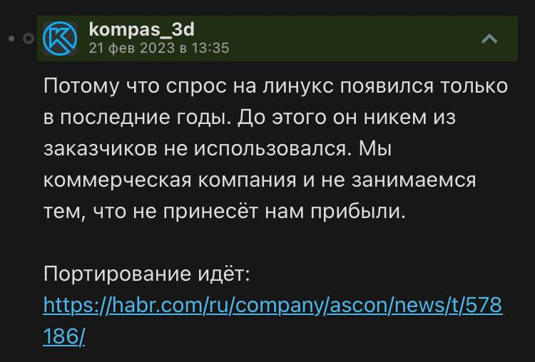

# Утверждение: КОМПАС-3D на Linux. Невозможно?

Стремление исполнить свои мечты делает нас сильнее. А чтобы достичь комфорта, иногда нужно мыслить как Мартин Лютер Кинг. Возможно, даже действовать. Вы поняли мою мысль.

Знакомить с КОМПАС-3D я вас не буду - на момент написания статьи я и сам о нем немного знаю. Но распространяется продукт исключительно на Windows. Также он там и поддерживается.

Далее я предлагаю познакомиться с историей портирования Компаса и проведенным ресерчем, но если вас это не интересует, можете [сразу перейти сюда](#installation).

## История портирования. Чтение материалов. Наши выводы.

Неисповедимые пути судьбы вынудили компанию АСКОН с 2020 года начать разработку уже кроссплатформенной версии данного CAD. И все бы ничего, но за 4 года у клиентской базы появилось только больше вопросов: Unix-based ОС для российского рынка уже сделали, уже внедрили в госструктуры... А с чем работать-то? Где софт?

И если, например, на ломаный МойОфис - аналог продуктов MS Office - средства нашлись, то АСКОН продолжает, мягко говоря, ковырять палкой в песке, ссылаясь на какой-то "коммерческий успех затеи".



Путь от идеи до написания гайда по установке у АСКОН занял три долгих мучительных года: только с февраля 2023-го года начали появляться реальные гайды по установке:

* [инструкция по установке](https://habr.com/ru/companies/ascon/articles/715268/) для enterprise-решений;
* [гайд по установке](https://habr.com/ru/companies/ascon/articles/715710/) на Wine 8.0.

> На этом моменте я очень рекомендую познакомиться с таким понятием, как **Wine** - что это, в чем заключается его работа, и *почему это не эмулятор*. <br><br>
> [Ссылка на материал.](https://gitlab.winehq.org/wine/wine/-/wikis/Wine-User's-Guide#what-is-wine)

Прочитав официальные гайды и пройдясь по источникам, можно выдвинуть следующие тезисы:

1. Wine - единственный способ поставить КОМПАС-3D на Linux без последствий для здоровья. Есть другие задачи, надо поставить все сразу, быстро и оперативно.
1. Обычный Wine не подойдет. АСКОН уже довольно долго сотрудничает с компанией Etersoft, которая предоставляет свое закрытое решение. Есть смысл взять его на вооружение по следующим причинам:
    * Etersoft буквально оптимизируют решение под КОМПАС-3D - он входит в официальный список поддерживаемых приложений.
    * АСКОН предоставляет официальную поддержку КОМПАС-3D для WINE@Etersoft.


По гайду ожидается, что мы быстренько возьмем и купим платную Enterprise-версию WINE@Etersoft. 

:)

Попробуем сделать все, чтобы сэкономить и при этом ничего не сломать.

Если порыться на сайте Etersoft, то можно наткнуться на страницу для получения версии WINE@Etersoft для учебных заведений. Перейдя по ссылке, нас ждет сильное разочарование - "поддержка прекращена, шейхи уехали".


После недолгого ресерча открывается вид на WINE@Etersoft Local - бесплатный вариант данного чуда. Есть незначительный нюанс: техподдержка Etersoft по данной версии не консультирует. **Но это не относится к поддержке КОМПАС-3D.**

## <a name="installation"></a>Установка

В рамках этой статьи установка проводилась на Ubuntu 24.04 с графической оболочкой KDE. Другие дистрибутивы поддерживаются, но здесь не рассматриваются. [Почитать про все возможные баги можно здесь.](https://unixforum.org/viewforum.php?f=58)

**[На всякий случай: официальная и не очень актуальная статья по установке и использованию.](https://winehq.org.ru/WINE@Etersoft/Local)**

### Устанавливаем WINE@Etersoft Local

Переходим по [ссылке](https://sales.etersoft.ru/wine/local/order) и заполняем анкету на получение дистрибутива.


В ответ нам приходит письмо с персональной ссылкой. Перейдя по ней, вам надо будет подтвердить передачу дистрибутива. По сути, это как иметь собственный экземпляр на диске. Обязательно читайте правила использования, чтобы знать рамки своей ответственности.

> Если письмо не приходит в течение 15 минут - ПРОВЕРЬТЕ СПАМ. Их рассылка работает оперативно, я лично так два часа протупил.


На той же ссылке вам станет доступна возможность заказать себе сборку на определенный дистрибутив Linux.

Вторым письмом вам уже придет ссылка на скачивание всего необходимого. Настоятельно рекомендую скачать скрипт `wine-etersoft-install.sh` и установить все следующей командой:

`sudo bash *путь-к-скрипту*/wine-etersoft-install.sh`

Если использовать скрипт, то установка займет минут 20 от силы. Наберитесь терпения и **ОМГ** выделите побольше памяти этой зверюге, места ему надо много.

После установки перейдите в директорию `/etc/wine-etersoft` и убедитесь, что файл лицензии `wine-etetsoft.lic` был добавлен. Его можно добавить вручную, скачав по ссылке из письма сборки.


Если в вашем терминале все работает так, как на картинке выше, то WINE@Etersoft установлен. Вы просто великолепны. Пора перейти к скачиванию софта.

### Скачиваем КОМПАС-3D

Далее, вроде, более знакомый всем сценарий - необходимо [перейти по ссылке](https://edu.ascon.ru/main/download/cab/) и заполнить анкету на получение КОМПАС-3D (на момент написание анкеты мы работаем с Учебной Версией v22).


Далее скачиваете архив.

Обновление, которое АСКОН просят поставить, **скачивать не надо.** На то есть две причины:

1. Разрешил преподаватель.
1. [У вас просто не включится КОМПАС-3D.](#update-error)

### Устанавливаем КОМПАС-3D

Мы заходим на территорию с непредсказуемым исходом. Если понимаете, что установка идет не по плану, останаливайте процесс и удаляйте/переименовывайте эту директорию:

`/home/*имя-профиля*/.wine`.

Но почему именно так?

WINE@Etersoft уже установлен и гарантированно не будет выдавать ошибок. Теперь все, что может нам помешать, это некорректно поставленное окружение `.wine` (путь к нему написан чуть выше). С установкой первого приложения окружение начинает разворачиваться.

**Уточняем на берегу - ни в коем случае не запускайте команды wine через sudo! Есть нехилый риск убить себе компьютер.** [Здесь написано, что делать, если все же запустили.](https://gitlab.winehq.org/wine/wine/-/wikis/FAQ#should-i-run-wine-as-root)

Через терминал перейдите в директорию с установщиком КОМПАС-3D (папка с файлом `Setup.exe`) и введите команду:

`wine_install_kompas`

Есть другие варианты вызвать установщик, даже согласно инструкции, но они просто не работают. Без понятия, почему так.

Будут отображаться странные логи. В один момент может даже показаться, что установка крашнулась. Ждите и терпите.

В какой-то момент появится волшебное окошко установщика КОМПАС-3D. Дело за малым - указывайте, где что должно лежать и запускайте установщик.

Вот на данном этапе установка может наверняка обломаться. Пересоздавайте .wine-окружение и запускайте установку по новой. 2-3 раз должно хватить.

После этого установщик предложит вам запустить приложение. Пробуйте и наслаждайтесь использованием. У вас получилось!

## Описываем user experience

Я настоятельно рекомендую сначала позапускать приложение, вызывая .desktop-файл через терминал (по сути, иконка на вашем рабочем столе). Так вы сможете смотреть логи в терминале в процессе работы и привыкнете к некоторым "капризам" приложения. Вдобавок иногда запуск "напрямую через рабочий стол" просто не работает (фикс смотреть [здесь](#desktop-file)).

На момент написания статьи уже сделано 2 лабораторные работы - в рамках них опробована работа с чертежами и 3D-моделями. Стараюсь собирать обратную связь и фиксировать баги. Есть незначительное замедление, но есть и подозрение, что на Windows все работает еще хуже. Объяснить трудно. В любом случае, данный способ установки оказался наиболее удобным и комфортным в использовании.


Все ныне обнаруженные проблемы смотрите ниже.

## Найденные баги/ошибки/недостатки

### <a name="update-error"></a>Невозможно запустить после обновления до 22.0.10

Если поставить обновление 22.0.10 через Wine, то КОМПАС при запуске будет просить очень много .dll-библиотек, которых у вас наверняка нет. Вдобавок еще может зафризить вам компьютер на пару минут в ходе запуска. Возможно, самые любознательные могут попробовать поставить библиотеки в system32 и посмотреть реакцию, но это только будет означать, что вам нужно новое хобби. Либо побольше домашних заданий.

### Вылетела ошибка от Wine Debugger. КОМПАС крашнулся, и у меня ничего не сохранилось

Мне очень жаль, что это произошло. К сожалению, придется чаще сохранять процесс, ибо исправить ситуацию будет затруднительно. Приложение может и будет вылетать, с этим сложно что-то поделать.

### <a name="desktop-file"></a>Не работает .desktop-файл КОМПАС-3D / не хватает иконки

Вам придется скачать иконку... Я потерял путь к оригинальной. Плюс, вроде как, оригинальные названия иконок генерятся, это неудобно.

1. <a href="kompas.ico" download>Скачайте иконку</a>
1. Откройте .desktop-файл КОМПАС-3D в любом IDE и замените его содержимое следующим:

```
[Desktop Entry]
Comment[ru_RU]=Система трехмерного моделирования КОМПАС-3D Учебная версия
Comment=Система трехмерного моделирования КОМПАС-3D Учебная версия
Exec=env WINEPREFIX=/home/*имя-профиля*/.wine wine /home/*имя-профиля*/.wine/dosdevices/c:/*путь-к-файлу*/ASCON/'KOMPAS-3D v22 Study'/Bin/kStudy.exe
GenericName[ru_RU]=
GenericName=
Icon=*путь-к-файлу*/kompas.ico
MimeType=
Name[ru_RU]=KOMPAS-3D
Name=KOMPAS-3D
Path=/home/*имя-профиля*/.wine/dosdevices/c:/*путь-к-файлу*/ASCON/KOMPAS-3D v22 Study/Bin/
StartupNotify=true
StartupWMClass=kstudy.exe
Terminal=false
TerminalOptions=
Type=Application
X-KDE-SubstituteUID=false
X-KDE-Username=
```

### При запуске КОМПАС-3D с ранее открытым файлом отображается черное окно чертежа/модели

Подвигайте окно, удерживая правую кнопку мыши. Должно пройти.

### Если закрепить окно справки поверх остальных, то оно багает UI

И это проблема? КОМПАС-3D запустился и не вылетел. Радуйся.