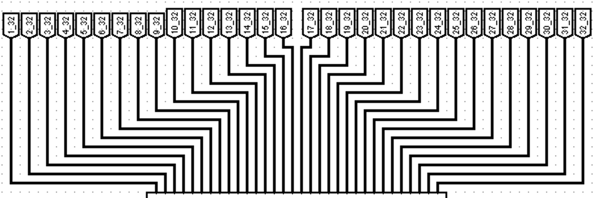
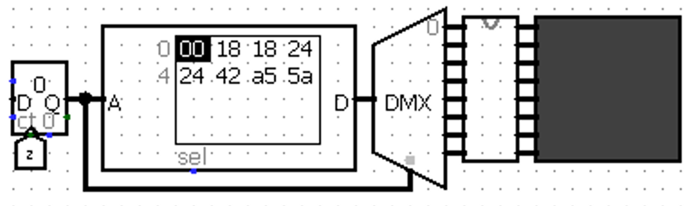
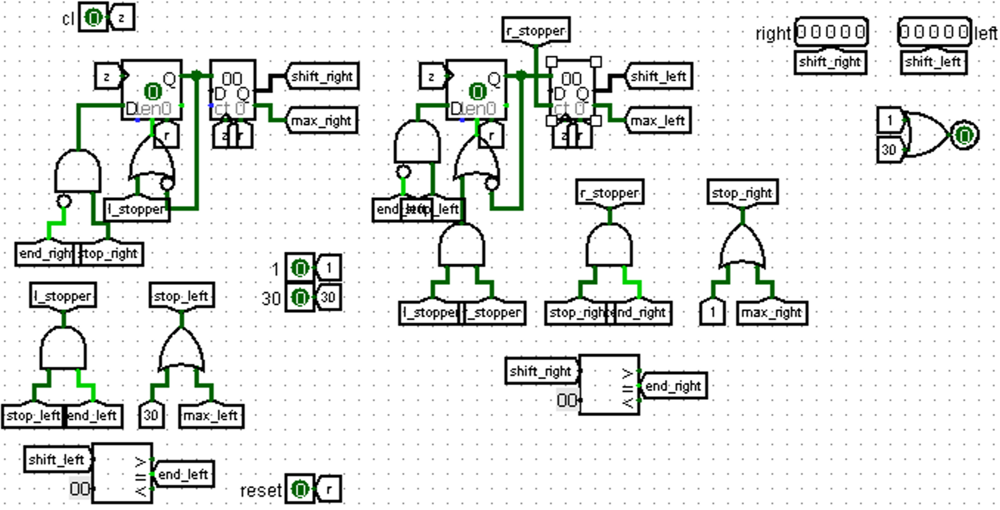

# Классический Logisim станет гораздо мощнее — он получит функционал…

### Я только открыл Logisim

Ну здравствуй, мой юный любитель минималистичных схем и проводов. Сейчас я буду твоим Вергилием, хоть и не считаю это место адом. 

Для начала открой Logisim. Если уже открыл, то молодец. А теперь найди слева “папку” Проводка, нажми на неё, затем нажми на находящийся там компонент [Контакт](i-woke-up-and-opened-logisim.md#pin). Теперь поставь его на белое поле справа. Затем ткни на поставленный контакт и нажми Ctrl+D, поставь скопированный контакт где-нибудь рядом и соедини их проводами (если что их можно поворачивать с помощью стрелок). Теперь на панели сверху найди инструмент Нажатие (Ctrl+1) и попробуй изменить значения на контактах. Поздравляю, ты сделал хуйню, но это философская хуйня, она была нужна во имя познания. 

Скорее всего ты уже умудрился вызвать замыкание, а чтобы его не было нажми на один из поставленных контактов, найди в параметрах (они будут ниже раздела с “папками”) “Выход?” и измени значение на “Да”.

А теперь к тому, что вообще я пытался тебе показать. 

Существуют стандартные библиотеки, в них расположено практически всё, что тебе понадобиться в течении семестра. В этих библиотеках есть разные компоненты, которые можно легко и быстро копировать (я пользовался Ctrl+D очень часто). Для установки компонентов и их редактирования используется инструмент Курсор, а для изменения значений в них или просмотра значений, передающихся по проводу — Палец. Пока ты менял значение мог увидеть, что провод горел четырьмя разными цветами. Вообще в Logisim их 6:

1. Темно-зелёный — сигнал равен 0.
2. Светло-зелёный — сигнал равен 1.
3. Синий — сигнал равен X.
4. Красный — error (чаще всего замыкание)
5. Чёрный — все не однобитные данные, не содержащие error.
6. Оранжевый — ошибка разных разрядностей элементов.

А вот значений, которые может принимать бит 4:

1. Ноль
2. Один
3. X — думаю тут надо остановиться. Вообще в схемотехнике этот сигнал находится где-то между нулём и единицей. Основной его прикол в том, что данный бит принимает любое значение, которое будет наложено “поверх” него.
4. Error — просто ошибка. С данным значением нельзя работать (если быть честным, то можно, но только очень осторожно и в крайне специфичных случаях).

А ещё ты увидел, где можно менять параметры компонентов. Предлагаю изменить параметры контактов. 

Для ускорения этого процесса стоит либо выделить область, в которой находятся контакты, или поочередно нажать на них, зажимая shift. Теперь в окне параметров можно увидеть все совпадающие параметры компонентов, в нём же их можно поменять (так можно менять и не совпадающие параметры). 

Кстати, если нажать на компонент в библиотеке и поменять его параметры до того, как ты поставишь его на схему, то новые параметры будут начальными для всех последующих компонентов.

На этом основы основ можно закончить. 

Из ещё не обговоренных нюансов есть прикол с Ctrl+C и Ctrl+V. 

Если вам понадобиться перенести какую-либо часть схемы из одного файла в другой, то следует убедиться, что оба файла открыты одинаково. Просто каждый запуск Logisim создаёт как бы отдельную область, с которой он работает (у меня это буквально отображается как два открытых Logisim), так что один из файлов для копирования и вставки должен быть открыт через Ctrl+O (ну или кнопку “Открыть” в самом приложении).

А теперь перейдём к насущным проблемам, с которыми ты можешь столкнуться.

### Разрядности не в том порядке

О, это, кстати, классическая проблема. 

В Logisim имеется встроенный [Расширитель битов](i-woke-up-and-opened-logisim.md#extender), но лично я предпочитаю [Разветвитель](i-woke-up-and-opened-logisim.md#splitter) (или как говорят в русских деревнях rascheska), так как он занимает меньше места и зачастую функциональнее. 

Ниже сравнение этих двух способов (вариант с разветвителем сверху, а снизу с расширителем). 

### Палец болит от постоянных проверок данных

Просто используй [Датчики](i-woke-up-and-opened-logisim.md#probe), благо у них куча вариантов представлений данных, поступивших на них, либо смирись с болью. 

### У меня экран в X-ах, а я даже инкогнито ещё не открыл

Значение X можно привести к чему-то адекватному не только подавая на вход другие данные, но и используя [Согласующий резистор](i-woke-up-and-opened-logisim.md#pull). 

И это была бы замечательная новость, если бы Logisim мог адекватно поддерживать большие схемы, просто иногда из-за наличия этого резистора могут появляться очень странные ошибки (совсем не теоретическая ситуация). 

Но повторюсь, такое случается в основном на больших схемах.

### О нет, я пролил пиво на кнопку Print Screen, и теперь она не работает

Есть два варианта: 

1. Косплей Папича
2. Встроенный в Logisim скриншот)

Нажми на вкладку файл и найди “Экспортировать изображение…”. 

Да, это просто фан-факт, который мне очень понравился, и я решил о нём рассказать (узнавать что-то новое о Logisim после написания проекта — ахуенно).

### Мне очень-очень нужен if, else и elif

Тут такое есть. 

Если тебе нужен просто if, то рекомендую [Управляемый буфер](i-woke-up-and-opened-logisim.md#controlled) (если вы хотите утратить человечность, то и [Транзистор](i-woke-up-and-opened-logisim.md#transist) сойдёт, но я буду на вас косо смотреть). 

А если нужен if+else или даже elif, то с этим справится [Мультиплексор](i-woke-up-and-opened-logisim.md#mux).

### Провода душат

Используй [тоннели](i-woke-up-and-opened-logisim.md#tunnel). 

Когда будешь именовать тоннели, старайся не злоупотреблять “магическими” названиями, либо же делай их единообразными. 

Пример: в моём проекте было множество данных, которые шли друг за другом, поэтому такие тоннели именовались как n_b, где n — порядковый номер тоннеля, а b — количество бит (да, иногда приходилось добавлять дополнительные буквы к названию, но и их я старался не брать с потолка).

### Моё решение какое-то излишне громоздкое, я хочу его уменьшить

Надеюсь, что твоё решение содержит много повторяющихся сегментов, потому что в этом случае у меня есть ответ — и это подсхемы. 

Для создания подсхемы нажми ПКМ на “папке” с названием файла. Выбираем вариант Добавить схему, пишем её название и всё. Здесь воспроизводим нужную нам схему. 

Финальным действием будет редактирование внешнего вида подсхемы. Наверху, под инструментом вставки текста, будет кнопка редактирование внешнего вида схемы.

Важно помнить, что схема должна быть понятной (или иметь говорящее название). Это же касается и её внешнего вида, порою очень хочется оставить простой прямоугольник, но так лучше не делать, если схема сложная или важная. 

У схем достаточно говорящее название, поэтому их устройство понять будет проще

А сейчас расскажу крайне важную вещь для отладки подсхем: ты можешь увидеть, как схема работает в настоящий момент, если возьмешь в качестве инструмента палец и дважды нажмешь в центр схемы (должен появиться значок лупы, и именно на него надо нажать).

### Мне кажется с Logisim что-то не так

Нет, тебе не кажется. Logisim написан на Java (это, кстати, значит, что в теории ты можешь сам написать свой собственный компонент или изменить принцип работы какого-нибудь компонента), а из этого следуют его странности. 

В целях ускорения работы, рекомендую все длинные провода заменить на [тоннели](i-woke-up-and-opened-logisim.md#tunnel), а также разбить проект на множество подсхем (фанатично засовывать a+b на подсхему не надо).

Если ваша программа вдруг резко начала выдавать ошибку в каком-то месте (вы его не трогали и уверены, что там всё работает верно), тогда стоит перезапустить Logisim (сначала перезапустите и только, если ошибка не пропала ищите её источник, а то я так минут 20 своей жизни проебал).

Далее информация, которую мне лень проверять, но я доверюсь знаниям древних:

Максимальная частота в программе составляет 4,1 кГц, но это не предел, как было изведано. Предел составляет 16кГц. Как разогнать ваш проект до таких скоростей?

Рассказываю:

- Скачиваем Logisim Evolution [https://sourceforge.net/projects/logisimevolution/](https://vk.com/away.php?to=https%3A%2F%2Fsourceforge.net%2Fprojects%2Flogisimevolution%2F&cc_key=)
- Ставим его в одну папку вместе с обычным Logisim
- Открываете в Evolution любую схему с тактовым генератором, и ставите максимальную частоту там (при этом сам Logisim закрыт)
- Открываете обычный Logisim
- Не трогаете частоту. Получаете ваши 16 кГц. Может пригодится для проектов, где необходима огромная частота

На самом деле в классическом Logisim ты скорее всего никогда не увидишь и 4,1 кГц, ведь реальная частота будет сильно отличаться от этой (иногда было стойкое ощущение, что на 512 Гц схема работала даже быстрее, чем на 4,1 кГц).

### А как рисовать?

Я не буду разбирать визуализацию игры на [терминале](i-woke-up-and-opened-logisim.md#tty), просто скажу, что теоретически это возможно. Сейчас мы поговорим о [матрицах](i-woke-up-and-opened-logisim.md#dotmat). 

Разница между вертикальной и горизонтальной, как между левой и правой палочкой twix (лично я предпочитаю правую), а вот третий режим работы крайне специфичен. 

Итак, нам нужен двухцветный рисунок будущего объекта (да, матрица способна поддерживать три цвета пикселей, но один из них это цвет ошибки, и я его настоятельно не рекомендую использовать), для удобства его создания рекомендую использовать какое-либо приложение для пиксель-артов. 

Когда рисунок готов надо представить его в двоичном коде (я просто оставлю это здесь [https://www.dcode.fr/binary-image](https://www.dcode.fr/binary-image), с этим сайтом ещё надо разобраться, плюс он иногда лагает, но я в тебя верю). А после этого записать полученный результат в [ПЗУ](i-woke-up-and-opened-logisim.md#rom) (если быть ещё более точным, то результат надо перевести в 16-ричную систему). 

Далее нам понадобиться сделать схему из [счётчика](i-woke-up-and-opened-logisim.md#counter), [ПЗУ](i-woke-up-and-opened-logisim.md#rom), [демультиплексора](i-woke-up-and-opened-logisim.md#demux), матрицы и секретной подсхемы.

Что-то вроде этого (если интересно, то на рисунке просто хуёвый космический корабль)

Секретная подсхема состоит из восьми 8-битных [регистров](i-woke-up-and-opened-logisim.md#register) (матрица же 8 на 8), 8 входных [контактов](i-woke-up-and-opened-logisim.md#pin), 8 выходных и [тактового генератора](i-woke-up-and-opened-logisim.md#clock). Возможно, что у тебя не будет работать данная схема, попробуй изменить параметры демультиплексора “Три состояния?” на “Да” и “На отключённом выходе” на “Плавающее”, тогда всё должно заработать. 

Это самая стандартная схема вывода изображения на матрицу и на её основе можно создать покадровую анимацию. Нужно просто увеличить количество ячеек памяти в ПЗУ, а также добавить [делитель](i-woke-up-and-opened-logisim.md#mult-div) в схему.

Альтернативой ПЗУ могут служить [константы](i-woke-up-and-opened-logisim.md#const). В этом случае на появление рисунка потребуется 1 такт, а анимация в данном варианте реализуется через [мультиплексоры](i-woke-up-and-opened-logisim.md#mux) в сочетании с счётчиком.

Вообще, я слукавил, когда сказал, что рисунок должен быть двухцветным, ведь Logisim позволяет накладывать матрицы друг на друга, тем самым создавая иллюзию многоцветной картинки. Тут есть лишь одно правило: входные контакты матриц не должны соприкасаться. Лучше всего в этом случае использовать подсхему:

Слева фрагмент подсхемы, а справа как это выглядит при подключении матриц

Ещё стоит сказать, что порядок наложенных матриц Logisim определяет случайно, так что какие-то пиксели могут быть не видны, но если просто подвигать матрицы, то можно это исправить.

Также компонентом для визуализации может быть [светодиод](i-woke-up-and-opened-logisim.md#led). Если вы сможете сделать на нём красивую игру, то тебе ничего не будет за это, просто почёт и респект от нашей передачи (а если честно, очень бы хотел это увидеть). 

Поговаривают, что 4 светодиода можно наложить друг на друга (выходы должны быть направлены в разные стороны) и получить компонент, воспроизводящий 5 цветов (если у вас не работает, то нужно переустановить Logisim).

### Я хочу двигать объекты

Компоненты для ввода будут рассмотрены ниже, а пока я просто объясню основные способы передвигать изображения. Основных 2:

1. Сделать сдвиг числа
    1. Используя [сдвигатель](i-woke-up-and-opened-logisim.md#shifter)
    2. Используя [множитель/делитель](i-woke-up-and-opened-logisim.md#mult-div)
2. “Поменять” значения в ячейках памяти
    1. Меняя данные в [регистрах](i-woke-up-and-opened-logisim.md#register)
    2. Используя [мультиплексор](i-woke-up-and-opened-logisim.md#mux)
    3. Используя [сдвиговый регистр](i-woke-up-and-opened-logisim.md#shiftreg)

Стоит понимать, что не обязательно напрямую перезаписывать значения в [регистрах](i-woke-up-and-opened-logisim.md#register), можно просто менять порядок, в котором они выводятся. Тоже касается сдвига числа, можно просто менять порядковое число сдвига. 

### Как понять, что объекты столкнулись

С помощью логического и. Если при логическом умножении результат равен 0, то объекты не столкнулись. 

### А как рулить?

Да, это раздел про управление игрой. Есть два основных варианта управления игрой: [клавиатура](i-woke-up-and-opened-logisim.md#keyboard) и [кнопки](i-woke-up-and-opened-logisim.md#button). Кнопки для управления я использовать не рекомендую, особенно если у вас не однокнопочная игра, ведь переключаться между ними будет банально неудобно. 

Помимо этого проблема и в их размере, ведь чем меньше масштаб вам будет нужен для проекта, тем сложнее будет найти нужную кнопку.

А ещё у кнопок существует проблема синхронизации, которая подробно будет освещена в другом разделе. А теперь перейдём к клавиатуре. 

Идеальный вариант управления, так как количество используемых кнопок в проекте ограничивается лишь вашей фантазией. При использовании клавиатуры тебе точно понадобиться АЛУ (думаю ты уже знаешь, что это, ведь одно из заданий Cocomaru было про АЛУ). 

Но АЛУ — это другая тема, а сейчас я хотел бы рассказать о способах подключения клавиатуры:

1. Стандартный — подключаем куда надо [тактовый генератор](i-woke-up-and-opened-logisim.md#clock) и просто наслаждаемся работой компонента.
2. Интересный — здесь нет тактового генератора. Вообще. Изначально запись в клавиатуру разрешена, когда же пользователь вводит какое-либо значение в клавиатуру, она блокируется, затем АЛУ обрабатывает поступивший сигнал и позже подаёт сигнал о завершении работы с поступившими данными, буфер клавиатуры очищается и компонент снимается с блокировки.  

### Мне кажется с Logisim что-то не так 2

Иногда не срабатывают кнопки? Всё работает медленнее, чем могло бы? Сейчас попробуем разобраться.

[Тактовый генератор](i-woke-up-and-opened-logisim.md#clock) создаёт немало проблем, ведь по сути своей он делит все компоненты на две категории: зависимые от него и независимые. А начнём мы обсуждение этой проблемы с [кнопок](i-woke-up-and-opened-logisim.md#button).

Тут вот в чём прикол, кнопка выдаёт единицу, пока пользователь жмёт на неё. И вроде бы всё в порядке, но нажатие на кнопку длинною в полтакта может привести к потере сигнала, если попытаться сохранить сигнал кнопки в блоке памяти. Выходом из данного положения будет следующая схема: 

, если что)](logisim-introduction/31c7700b-5775-45f4-be1a-43171c95d15c.png)

Именно так я реализовал кнопки старт, пауза и перезапуск (это [триггеры](i-woke-up-and-opened-logisim.md#flipflops), если что)

В этом случае сохранение сигнала кнопки гарантированно (можно ещё данные с кнопки подать на левый нижний вход, но мне этот вариант кажется менее эстетичным).

Не уходя далеко от темы асинхронных изменений. Честно говоря, я не знаю, кто додумался до встроенной очистки блоков, но я бы сломал ему что-нибудь. Данная очистка, предположительно, работает на частоте твоего процессора. В чём же проблема? Проблема заключается в сложности обнуления значения в памяти при выполнении какого-либо условия. Сейчас поясню на примере. 

Как-то раз мне требовался bcd сумматор для таймера. Это значит, что при операции 9+1 я должен обнулить получающееся значение и передать бит C следующему модулю. Самая простая реализация не давала результатов, ведь бит C даже не успевал появиться, так как память в [регистре](i-woke-up-and-opened-logisim.md#register)очищалась мгновенно. А добавление костылей привело к проблемам с таймером (тупящий таймер, на котором на долю секунды появлялась буква A). 

Возможно меня подводит память, но проблему с очисткой я решил через использование двух регистров, где один передавал бит C и очищался позже, а второй выводил значение и очищался сразу же. 

Но так как очистка это игрушка дьявола, то появилась схема, в которой она не используется (и нет лишнего регистра): 

Следующий раздел проблем синхронизации посвящен взаимодействиям между компонентами.

Начнём с малого. Если требуется обеспечить задержку передачи данных между компонентами с одинаковым фронтом, то может помочь несколько двойных компонентов Не.

Более радикальным способом обеспечения задержки являются разные фронты у компонентов. В качестве примера приведу следующую схему:

Эта схема была нужна для движения противников влево-вправо до границ. Сначала счётчик увеличивается, а дойдя до предела начинает уменьшаться, а после достижения нуля, начинал считать второй счётчик

Здесь [D триггеры](i-woke-up-and-opened-logisim.md#flipflops) работают с задним фронтом, а [счётчики](i-woke-up-and-opened-logisim.md#counter) — с передним.

### А как добавить CdM-8?

Скачиваем нужный файл, затем открываем Logisim и делаем то же, что делали при создании новой схемы, только теперь выбираем Загрузить библиотеку. Поздравляю, теперь у тебя есть новая библиотека. 

А вот для изменения компонентов в ней нужно открыть изначальную схему, ведь редактировать библиотеки нельзя.

На данный момент это все стандартные проблемы, которые я смог вспомнить. Желаю удачи и помни, что эксперименты тут поощряются.