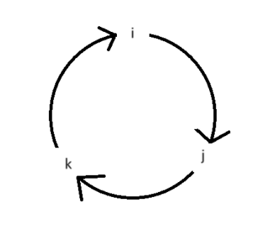
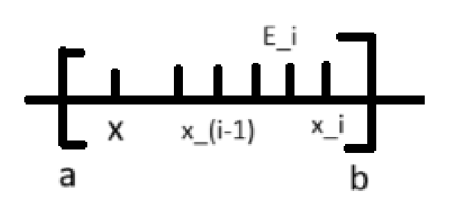

# Определения к экзамену по матанчику, второй семестрик

<!--
---

## Список Мальковича:

[Определения, примеры:](#1)

[Матрица Грама, ортонормированный базис](#1-1)

[Ортогональное дополнение](#1-2)

[Группа аффинных преобразований: сдвиги, повороты, растяжения](#1-3)

[Изометрия евклидового пространства; ортогональная матрица](#1-4)

[Собственные числа и векторы; характеристический многочлен](#1-5)

[Простое отношение тройки точек](#1-6)

[Кватернионы, сопряженный кватернион, модуль, чисто мнимый кватернион](#1-7)

[Первообразная и интеграл; неберущийся интеграл](#1-8)

[Основные табличные интегралы](#1-8-1)

[Определенный интеграл, приращение первообразной](#1-9)

[Формула Ньютона-Лейбница](#1-10)

[Свойства определенного интеграла](#1-11)

[Разбиение отрезка, интегральная сумма Римана, интегрируемость по Риману; суммы Дарбу](#1-12)

[Ступенчатые функции; пример неинтегрируемой по Риману функции](#1-13)

[Равномерная непрерывность, примеры](#1-14)

[Несобственный интеграл, степенная особенность](#1-15)

[Условно сходящийся интеграл, пример](#1-16)

[Ряды, сходимость, примеры](#1-17)

[Константа Эйлера-Маскерони](#1-18)

[Ортонормированная система функций](#1-19)

[Ряд Фурье, коэффициенты, комплексный вид](#1-20)

[Ядро Дирихле](#1-21)

[Носитель функции, финитные функции](#1-22)

[Условие Липшица](#1-23)

[Интеграл Фурье как непрерывный аналог ряда Фурье, комплексная форма](#1-24)

[Интеграл Дирихле](#1-25)

[Условия Дини](#1-26)

[Преобразование Фурье, прямое, обратное, синус, косинус](#1-27)

[Утверждения:](#2)

[Теорема о независимости ортогональных векторов](#2-1)

[Теорема о движении евклидового пространства](#2-2)

[Модуль собственных чисел ортогональных матриц](#2-3)

[Теорема Эйлера о вращении трехмерного пространства](#2-4)

[Характеристическое свойство аффинных преобразований](#2-5)

[Вращение трехмерного пространства с помощью кватернионов](#2-6)

[Свойства неопределенного интеграла](#2-7)

[Теорема Коши о неопределенном интеграле (без док-ва)](#2-8)

[Формулы замены переменной и интегрирования по частям](#2-9)

[Теорема о независимости определенного интеграла](#2-10)

[Теорема об интегрируемости по Риману](#2-11)

[Необходимое условие интегрируемости](#2-12)

[Достаточное условие интегрируемости](#2-13)

[Интегрируемость непрерывной функции](#2-14)

[Свойства интегрируемых по Риману функций](#2-15)

[Интегральное неравенство треугольника](#2-16)

[Теорема о монотонности интеграла и два следствия из нее](#2-17)

[Теоремы о среднем (первая и о произведении)](#2-18)

[Формула Симпсона](#2-19)

[Остаток ряда Тейлора в интегральной форме](#2-20)

[Теорема об одновременной сходимости и расходимости интегралов](#2-21)

[Критерий Коши сходимости несобственного интеграла](#2-22)

[Интегральный признак сходимости ряда](#2-23)

[Вторая теорема о среднем (без док-ва)](#2-24)

[Признак Дирихле](#2-25)

[Признак Абеля](#2-26)

[Необходимое условие сходимости ряда. Лемма о конечном числе членов ряда](#2-27)

[Признак сравнения рядов](#2-28)

---

[Теорема об одновременной сходимости и расходимости рядов](#2-29)

[Признак Коши, предельная форма](#2-30)

[Признак Даламбера, предельная форма](#2-31)

[Признак Лейбница, пример](#2-32)

[Лемма об ортогональности тригонометрических функций](#2-33)

[Теорема о приближении абсолютно интегрируемых функций финитными](#2-34)

[Следствие о непрерывности первообразной](#2-35)

[Теорема Римана об осцилляции](#2-36)

[Лемма о коэффициентах Фурье функции и ее производной](#2-37)

[Теорема об асимптотике коэффициентов Фурье](#2-38)

[Признак Липшица сходимости ряда Фурье](#2-39)

[Признак Дини (без док-ва)](#2-40)

[Свойства преобразования Фурье](#2-41)

[Теорема о композиции прямого и обратного преобразований Фурье](#2-42)

[Лемма об асимптотике абсолютно интегрируемой функции](#2-43)

[Преобразование Фурье производной](#2-44)

[Формула Планшереля, ее смысл](#2-45)

[Равенство Парсеваля](#2-46)

[Теорема Котельникова](#2-47)

---

[Дополнительные определения](#3)

[Векторное пространство](#3-1)

[Евклидово пространство](#3-2)

[Аффинное пространство](#3-3)

[Группа](#3-4)

[Линейная комбинация](#3-5)

[Линейная оболочка](#3-6)

[Линейная зависимость](#3-7)

[Базис](#3-8)

[Колебание функции](#3-9)

-->

## Определения, примеры

### Матрица Грама, ортонормированный базис

Пусть $(\textbf e_1,\dots,\textbf e_n)$ — базис евклидова пространства $V$.

Тогда матрица $\textbf G=(g_{ij})_{i,j=1..n}$, где $g_{ij}=\textbf  e_i\cdot \textbf  e_j$ называется **матрицей метрических коэффициентов** базиса или **матрицей Грама.**

Свойства матрицы Грама:

- Симметричность (из симметричности скалярного произведения)
- $\forall \textbf  u\ne\textbf 0:\textbf  u \cdot \textbf  u >  0 \implies g_{ij} \gt 0 \implies \det G > 0$

Базис называется **ортонормированным**, если его матрица Грама единична.

Базис называется **ортогональным**, если $\forall i\ne j: \textbf e_i \cdot \textbf e_j = 0$ 

### Ортогональное дополнение

**Ортогональное дополнение** (обозн. $U^\perp$) — множество всех векторов ортогональных всем векторам из множества $U$.

Ортогональное дополнение всегда образует векторное пространство.

### Группа аффинных преобразований: сдвиги, повороты, растяжения

[**Группа](#3-4) аффинных преобразований $\mathbb R^2$** — преобразования в виде домножения на невырожденную матрицу 2х2, плюс некоторый вектор. 

Когда говорят **преобразование**, подразумевают биективность, в противном случае это просто отображение, у него может быть домножение на вырожденную матрицу.

В векторном пространстве система координат — набор векторов, а в аффинном — точка и базис

### Изометрия евклидового пространства; ортогональная матрица

**Движением (изометрией) евклидова пространства** $V$ называется отображение $f:V\to V$ сохраняющее расстояние

Матрица, составленная из ортонормированного базиса называется **ортогональной**

### Собственные числа и векторы; характеристический многочлен

Число $\lambda \in \mathbb C$ называется **собственным числом** матрицы $\textbf A$ с **собственным вектором** $\textbf v$, если $\textbf A\textbf v = \lambda\textbf v$

Для поиска полезно следующее равенство $\det(\textbf A - \lambda \textbf E) = 0$, оно является многочленом относительно $\lambda$, называемый **характеристическим многочленом** матрицы.

### Простое отношение тройки точек

В евклидовом пространстве для трёх точек *лежащих на одной прямой*, определим **простое отношение тройки точек** — число $\lambda$, такое что $\overline{AC} = \lambda\cdot \overline{CB}$.

### Кватернионы, сопряженный кватернион, модуль, чисто мнимый кватернион

$q \in \mathbb H \iff q = x + iy + jz + kw$ — **кватернион**

$i^2 = j^2 = k^2 = -1$

$ij = k\\jk = i\\ki=j$

Умножение кватернионов некоммутативно.

В **сопряженном** — вся мнимая часть с минусами.

$\overline{q_1\cdot q_2} = \overline{q_1} \cdot \overline{q_2}$

**Модуль кватерниона** — $|q|^2 = q \cdot \overline q = x^2 + y^2 + z^2 + w^2$

**Чисто мнимый кватернион** — кватернион, у которого вещественная часть равна нулю.

Кватернионы соответствуют матрицам поворота и работать с ними на практике эффективнее.

### Первообразная и интеграл; неберущийся интеграл

**Первообразной** функции для данной $f(x)$ на данном промежутке называется такая функция $F(x)$, что $F'(x) = f(x)$, или эквивалентно $dF(x) = f(x)dx$ (на рассматриваемом промежутке).

Первообразная определена с точностью до добавления константы.

Общее выражение для всех первообразных данной функции $f(x)$ называется **неопределённым интегралом** и обозначается $\int{f(x)dx}$

Интеграл взять можно не всегда (выписать первообразную в элементарных функциях не всегда возможно). Например $\int{e^{-x^2} dx}$ или $\int\frac {sin x} {dx}$.

#### Основные табличные интегралы

1. $\int x^ndx = \frac 1 {n+1} x^{n+1} + C$,   $n \not = 1$  
2. $\int \frac {dx} x = \ln x + C$
3. $\int a^xdx =\int {e^{\ln a * x}}dx =\frac {1} {\ln a} a^x + C$
4. $\int \cos x = \sin x + C$
    
    $\int \sin x  = -\cos x$
    
5. $\int \frac {dx} {\cos^2x} = \tan x + C$
    
    $\int \frac {dx} {\sin^2x} = -\cot x + C$
    
6. $\int \frac {dx} {\sqrt{1+x^2}} \arccos x + C$
7. $\int \frac {dx}{\sqrt{x^2 + \alpha}} = \ln |x + \sqrt{x^2 + \alpha}| + C$
8. $\int \frac {dx}{\sqrt{x^2 + \alpha}} = \ln |x + \sqrt{x^2 + \alpha}| + C$ 

### Определенный интеграл, приращение первообразной

Разбиение на отрезки

**Определённый интеграл**  (обозн. $\int\limits_a^b f(x)dx$)— предел **интегральной суммы Римана**$\sum\limits_{k=1}^n f(\xi_k) \cdot \Delta x_k$, когда длина отрезков стремится к нулю

**Приращение первообразной** $F(x)$ на $[a,b]$ : $F(B) - F(A)$

### Формула Ньютона-Лейбница

$\int_a^bf(x)dx = F(b)-F(a)$  — то есть определенный интеграл непрерывной функции равен приращению первообразной на отрезке

### Свойства определенного интеграла

1. $\int\limits_a^b f(x)dx = \int\limits_a^b f(t)dt$ (независимость от переменной интегрирования)
2. $\int\limits_a^bf(t)dt = -\int\limits_b^af(t)dt$
3. $\int\limits_a^c f(x)dx = \int\limits_a^b f(x)dx + \int\limits_b^c f(x)dx$
4. $\int\limits_a^b(\lambda f(x) + \mu g(x))dx = \lambda\int\limits_a^bf(x)dx + \mu\int\limits g(x)dx$ (линейность)
5. $f(x) \ge_{[a,b]} 0 \Rightarrow \int\limits_a^b f(x)dx$ (монотонность)

### Разбиение отрезка, интегральная сумма Римана, интегрируемость по Риману; суммы Дарбу

Разбиением $\rho$ отрезка $[a, b]$ называется конечная система точек $a = x_{0} < x_{1} < … < x_{n} = b$

Говорят, что разбиение с отмеченными точками, если в каждом интервале отрезка $[x_{i}, x_{i+1}]$ выбрана точка $\xi_{i+1}$

Пусть $f$ - функция на $[a, b]$,  $\rho$- разбиение с отмеченными точками.

$\Big(\delta (f, \rho, \xi)=\sum\limits_{i=1}^n\ f(\xi_{i})\varDelta x_{i}$ , где $\varDelta x_{i}=x_{i}-x_{i-1}\Big)$ - интегральная сумма Римана

Пусть $f: [a,b]\to\mathbb{R}$, говорят, что $f$ **интегрируема по Риману** и её интеграл равен $I$,

 $if$   $\forall \varepsilon >0$   $\exists \delta >0$ , т. ч. $\forall$ разбиений $(\rho, \xi)$ , 

у которого $max_{i=1..n}|x_i-x_{i-1}| < \delta |\delta (f, \rho, \varepsilon - I| < \varepsilon$

$\overline{I} + \underline{I} = I$

$\bigg($когда её верхний и нижний интегралы Дарбу совпадают и равны $I$. Обозн. $f\in R([a,b])$$\bigg)$

Множество всех функций интегрируемых по Риману на $[a,b]$ обозначается $R[a,b]$.

Пусть $f:[a,b]\to\mathbb{R}$, $s(f,P) = \sum\limits_{i=1}^n\inf\limits_{y\in[x_{i-1},x_i]} f(y)(x_i - x_{i-1})$ — **нижняя сумма Дарбу
$S(f,P) = \sum\limits_{i=1}^n\sup\limits_{y\in[x_{i-1},x_i]} f(y)(x_i - x_{i-1})$** — **верхняя сумма Дарбу**

**Нижний интеграл Дарбу** — то есть супремум нижних сумм для всех разбиений

**Верхний интеграл Дарбу** — то есть инфинум верхних сумм для всех разбиений

### Ступенчатые функции; пример неинтегрируемой по Риману функции

Функция определённая на промежутке называется **ступенчатой**, если существует разбиение этого промежутка на конечное число промежутков, на каждом из которых она постоянна.

Пример неинтегрируемой по риману функции: $f(x) = \frac 1 x$ на $[0,1]$. Потому что верхняя сумма Дарбу бесконечна при любом разбиении ($\sup$ первого отрезка бесконечен).

### Равномерная непрерывность, примеры

Функция называется **равномерно непрерывной** на множестве $E$ $\iff$
 $\forall \mathcal E > 0\ 
\exists \sigma\ 
\forall x_1, x_2\in E:\ 
|x_1-x_2| < \sigma \to
|f(x_1)-f(x_2)| < \mathcal E$.

Геометрический смысл равномерной непрерывности:

Если $f(x)$ равномерно непрерывна на $X$, то прямоугольник со сторонами $\sigma$ и $\mathcal E$ можно перемещать вдоль графика функции, так что график не пересечет горизонтальных сторон, а только вертикальные.

Картинка честно стырена

Пример: $f(x) = x^2$ не является равномерно непрерывной на $\mathbb{R}$.

Доказательство:

Рассмотрим $\mathcal E = 1,\ 
x_1 = \frac 1 \sigma + \frac \sigma 2,\ 
x_2 = \frac 1 \sigma$,

$|x_1-x_2| =
\frac 1 \sigma + \frac \sigma 2 - \frac 1 \sigma =
\frac \sigma 2 < \sigma$,

но: $|x_1^2 - x_2^2| = 
|x_1-x_2|\cdot|x_1 + x_2| = 
\frac \sigma 2 \cdot (\frac 2 \sigma + \frac \sigma 2) =
1 + \frac {\sigma^2} 4 \ge 1$ — противоречие определению.

На пальцах: прямоугольничек по функции двигать не получится, так как парабола возрастает чем дальше тем быстрее.

**Теорема Кантора-Гейне:** функция, непрерывная на замкнутом конечном промежутке (или на любом компакте), равномерно непрерывна на нём.

### Несобственный интеграл, степенная особенность

Пусть $[a,\omega)$ — конечный или бесконечный промежуток, $\forall [a,b] \in [a,\omega) : f\in R[a,b]$,

тогда определим $\int\limits_a^\omega f(x)dx = \lim\limits_{b\to\omega}\int\limits_a^b f(x)dx$ — **несобственный интеграл**.

**Свойства** несобственного интеграла:

- Если $\omega \in \mathbb{R}, f\in R[a,\omega]$, то значения интерала в римановом (собственном) и несобственном смысле совпадают.
- Линейность
- $c\in[a,\omega) \implies \int\limits_a^\omega f = \int\limits_a^c f + \int\limits_c^\omega f$
- Пусть $\phi:[a,\gamma) \to [a,\omega)$ — дифференцируемая, строго монотонная функция, $\phi(\alpha) = a$, $\lim\limits_{\beta\to\gamma} \phi(\beta) = \omega$, тогда $\int\limits_a^\omega f(x)dx =
\int\limits_\alpha^\gamma f(\phi(t))\phi'(t)dt$
- Формула интегрирования по частям

**Степенные особенности:**

- $\int\limits_{T>0}^\infty \frac {dx} {x^\alpha}$ — сходится при $\alpha > 1$
- $\int\limits_0^{\epsilon > 0} \frac {dx} {x^\alpha}$ — сходится при $\alpha < 1$

### Условно сходящийся интеграл, пример

Про несобственный интергал $\int\limits_a^\omega f(x)dx$ говорят, что он **сходится абсолютно**, если сходится интеграл $\int\limits_a^\omega |f(x)|dx$.

Несобственный интеграл, который сходится, но не абсолютно, называется **условно сходящимся**.

Пример условно сходящегося интеграла: $\int\limits_0^{\infty} \frac {\sin \alpha x\ dx} x =
sign\ \alpha \cdot\frac \pi 2$ — **Интеграл Дирихле**

### Ряды, сходимость, примеры

**Сумма ряда** — предел последовательности частичных сумм, то есть

$\sum\limits_{i=1}^\infty a_i = \lim\limits_{n\to\infty} \sum\limits_{i=1}^n a_n$

Если такой предел существует в $\mathbb{R}$, то ряд называется **сходящимся**.

Пример сходящегося ряда: $\sum\limits_{n=1}^\infty \frac 1 {n^2} = \frac {\pi^2} 6$.

Пример расходящегося ряда $\sum\limits_{n=1}^\infty \frac 1 n\uparrow$ — **гармонический ряд**.

### Константа Эйлера-Маскерони

**Постоянная Эйлера-Маскерони** — предел разности между частичной суммой гармонического ряда и натуральным логарифмом числа, то есть:
$\gamma =
\lim\limits_{N\to\infty}
(\sum\limits_{n=1}^{N}
\frac 1 n - \ln N)
\approx 0.57721$.

Неизвестно, является ли рациональным.

Может быть выражена как интеграл: $\gamma = - \int\limits_0^\infty 
\frac {\ln x} {e^x} dx$

### Ортонормированная система функций

Функции $f(x), g(x)$ называются **ортогональными** на отрезке $[a,b]$,

если  ${\overbrace{<f(x),g(x)>}}^{\text{скалярное произведение ф-ций}} = \int\limits_a^b f(x)g(x)dx = 
0$.

**Нормой функции** на $\phi(x)$ на отрезке $[a,b]$ называется число, равное
$|\phi(x)| = \sqrt {(\phi(x),\phi(x))} = \sqrt {\int\limits_a^b \phi^2 (x) dx}$

Система функций $\phi_j(x)$ называется **ортонормированной**,
если функции системы попарно ортогональны и норма каждой из функций равна $1$, эквивалентно:  $\int\limits_a^b\phi_i(x)\phi_j(x)dx = \begin{cases}
0,  &if \ i \ne j\\
1, & if \ i = j 
\end{cases}$

### Ряд Фурье, коэффициенты, комплексный вид

Пусть задана система функций $\phi_1(x), \phi_2(x), \dots$, тогда ряд вида $\sum\limits_{n=1}^\infty a_n\phi_n(x)$, где $a_n$  — некоторые вещественные или комплексные коэфициенты, **называется рядом по системе функций** $\phi_j(x)$.

Говорят, что $f(x)$ **разложима в ряд по системе функций**, если определены числа $a_n$, такие что, $\forall x\in Dom\ f : f(x) = \sum \limits_{n = 1} ^ \infty a_n\phi_n(x)$. 

Числа $a_n$ называются **коэфициентами Фурье**  функции $f$ по ортогональной системе, а ряд $\sum\limits_{n=1}^\infty a_n\phi_n(x)$ называется **рядом Фурье** функции $f$ по этой системе.

**Тригонометрическая система функций**: $1,\ \cos \frac \pi lx,\ \sin \frac \pi lx,\ \cos 2\frac \pi lx,\ \sin 2\frac \pi lx,\ \dots$

Она ортогональна на отрезке $[a,b]$, длины $l$.

При $l = \pi$, система называется **стандартной тригонометрической системой**.

**Тригонометрический ряд Фурье**:

$\frac {a_0} 2 + \sum\limits_{n=1}^\infty
a_n \cos {nx} + b_n \sin {nx}$, где коэфициенты вычисляются как:
$a_0 = \frac 1 l \int\limits_a^b f(x)dx$
$a_n = \frac 1 l \int\limits_a^b f(x) \cos n \frac \pi l x\ dx$
$b_n = \frac 1 l \int\limits_a^b f(x) \sin n \frac \pi l x\ dx$

Для разложения в такой ряд, надо сделать замену $\xi = \frac \pi l x$, где $l$ — длина периода $f(x)$ 

**Тригонометрическая система функций в комплексной форме**:
$\phi_v(x) = \cos v\frac \pi lx + i\sin v\frac \pi l x = e^{iv\frac \pi lx},\ v\in \mathbb{Z}$

**Тригонометрический ряд Фурье в комплексной форме**:
$\sum\limits_{v=-\infty}^\infty
c_v e^{iv\frac \pi l x}$, где коэфициенты:
$c_v = \frac 1 {2l} \int\limits_{-l} ^l f(x) e ^{-iv\frac \pi l x}dx$

### Ядро Дирихле

**Ядро Дирихле** — функция $D_n(x) =
\frac {\sin ((n + \frac 1 2) x)} {2\sin \frac x 2}$

Свойства:

- Четная
- $2\pi$-периодическая
- $\forall n \in \mathbb{N}: \int\limits_{-\pi} ^ \pi D_n(x)dx = \pi$

### Носитель функции, финитные функции

**Носитель функции $f$:**
$supp\ f =
\{x\in Dom f : f(x) \ne 0\}$

Функция на $\mathbb{R}$ называется **финитной**, ****если её носитель ограничен, то есть она обращается в ноль вне некоторого отрезка.

### Условие Липшица

Пусть $f$ определена в окрестности точки $x_0$, говорят, что $f$ **удовлетворяет условию Липшица** в $x_0$ порядка $\alpha > 0$, если
$\exists C, \sigma > 0\ \forall \xi\in(-\sigma,\sigma):\ |f(x_0 + \xi) - f(x_0)| < C|\xi|^\alpha$

### Интеграл Фурье как непрерывный аналог ряда Фурье, комплексная форма

**Интеграл Фурье**:
$\int\limits_0^\infty
[a(y)\cos yx + b(y)\sin yx]dy$, где:
$a(f,y) = \frac 1 \pi \int\limits_{-\infty}^\infty f(t)\cos y\ dt$,
$b(f,y) = \frac 1 \pi \int\limits_{-\infty}^\infty f(t)\sin y\ dt$

**Комплексная форма**: $v.p.\int\limits_{-\infty}^\infty
c(u)e^{iyx}du$, где
$c(f,y) =
\frac 1 2 (a(f,y)-ib(f,y)) =
\frac 1 {2\pi}\ v.p.\int\limits_{-\infty}^\infty f(t)e^{-iyt}dt$

$v.p.$ - principal value, главное значение по Коши

$\forall$ локально интегрируемой функции $\phi$ предел 

$\lim\limits_{l\to\infty}\int\limits_{-l}^l \phi(x)dx$ называют интегралом от $-\infty$ до  $\infty$ в смысле главного значения по Коши и обозначают $v.p. \int\limits_{-\infty}^\infty \phi(x)dx$

### [Интеграл Дирихле](#1-25)

### Одностороннее условие Дини

$f$ - абсолютно интегрируема на  $\reals$ ф-я в точке $x_0$ . Она имеет левый и правый пределы $f(x_0, \pm 0)$ и ф-ции $f \pm(\xi) = \frac {f(x_0 \pm \xi) - f(x_0 \pm 0)}{\xi}$ абсолютно интегрируемы на $\xi \in (0, \delta)$

### Преобразование Фурье, прямое, обратное, синус, косинус

Определённая на $\mathbb{R}$ функция называется **локально интегрируемой**, если она абсолютно интегрируема на любом конечном интервале.

Для любой локально интегрируемной функции $\phi(x)$, предел
$\lim\limits_{l\to\infty}\int\limits_{-l}^l \phi(x)dx$ называют **интегралом от $-\infty$ до $+\infty$ в смысле главного значения по Коши** и обозначают $v.p. \int\limits_{-\infty}^{+\infty}\phi(x)dx$.

**Преобразование Фурье**:
$f$ — абсолютно интегрируемая, выполняется условие Дини,
$\forall x\in\mathbb{R}: f(x)=\int\limits_{-\infty}^\infty c(f,y)\cdot e^{iyx}\ dy$,
$c(f,y)=\frac 1 {2\pi} \int\limits_{-\infty}^\infty f(x)\cdot e^{-iyx}\ dx$,
$\hat f(\xi) = v.p. \frac 1 {\sqrt{2\pi}}
\int\limits_{-\infty}^\infty f(x)\cdot e^{-i\xi x} dx$ — **прямое преобразование Фурье**
$\tilde f(\xi) = v.p. \frac 1 {\sqrt{2\pi}}
\int\limits_{-\infty}^\infty f(x)\cdot e^{i\xi x} dx$ — **обратное преобразование Фурье**

Определим операторы:
$F: f \to \hat f$,

$F^{-1}: f \to \tilde f$

$\sqrt \frac {2} {\pi} \int\limits_0^\infty f(x)\cos yx\ dx = F_c[f]$ — **косинус-преобразование Фурье**

$\sqrt \frac {2} {\pi} \int\limits_0^\infty f(x)\sin yx\ dx = F_s[f]$ — **синус-преобразование Фурье**

## Утверждения:

### Теорема о независимости ортогональных векторов

Любые ненулевые взаимно ортогональные векторы $e_1, .., e_n \in V$ линейно независимы. Если при $\underbrace{dim}_{\text{размерность}}V = n$, то эти векторы образуют ортогональный базис.

**Док-во:**

Второе сразу следует из первого.

От противного $\exists$ линейная (нетривиальная) комбинация $\lambda_1 \vec{e}_1 + .. + \lambda_m \vec{e}_m = \vec{0}$

Пусть $\lambda_k \not = 0$

$<\lambda_1 \vec{e}_1 + .. + \lambda_m \vec{e}_m = \vec{0}, {\vec{e}_m}>$

$0=<\vec{0}, \vec{e}_k> = \lambda_1<e_1, e_k> + \lambda_2<e_2, e_k> + .. + \lambda_k<e_k, e_k> + … + \lambda_m<e_m, e_k>$

$<e_j, e_k> = 0, j \not = k$        $\lambda_k <e_k, e_k>$    > 0   contr

### Процесс ортогонализации Грама-Шмидта

Пусть $e_1, .., e_m$ - система из $m$ линейно независимых векторов евклидова пространства V.

Существует ортонормированная система векторов  $e_1^{\prime}, .., e_m^{\prime}$, т. к. линейная оболочка 

$L_i = lin(e_1, .., e_i)$ и $L_i^{\prime} = lin(e_1^{\prime}, .., e_i^{\prime})$ совпадают $\forall i=1..m$

**Док-во:**

Индукция по $i$.

$e_i \mapsto e_i^{\prime} = \frac{e_i}{|e_i|}$

Пусть для $k$ первых векторов мы провели ортогонализацию $e_1^{\prime}, .., e_k^{\prime}$

$e_{k+1}^{\prime}$ - надо построить

$v = e_{k+1} + \sum\limits_{j=1}^{k} \lambda_j e_j^{\prime}$

$v \perp e_j^{\prime},$    $j=1..k$

$0=<v_i, e_j^{\prime}> = e_{k+1} + \sum\limits_{j=1}^{k} \lambda_l <e_l^{\prime}, e_j^{\prime}> = <e_{k+1}, e_j^{\prime}> + \sum\limits_{l=1}^{k} \lambda_l < e_l^{\prime}, e_j^{\prime}> = <e_{k+1}, e_j^{\prime}>+\lambda_j$

$< e_l^{\prime}, e_j^{\prime}> = \begin{cases}
   0, &\text{if } l\not=j \\
   1, &\text{if } l=j
\end{cases}$

$\lambda:=-<e_{k+1}, e_j^{\prime}> ⇒ v\perp e_j^{\prime}, .., e_k^{\prime}$

$e_{k+1}=\frac {v}{|v|}$

( Линейные оболочки совпадают, это видно по построению)

$e_k^{\prime} \in lin (e_1, .., e_k) ⇒ lin (e_1, .., e_j) = lin(e_1^{\prime}, .., e_j^{\prime})$

### Теорема о движении евклидового пространства

Отобр-е $f: V \to V$ является движение  $\iff f(\vec{x})=Q\vec{x} + \vec{b}$, где $Q$ - ортогон. м-ца $\text{\textbraceleft}{Q|Q^TQ=Id}\text{\textbraceright}=O(n)$

**Док-во: (в другую сторону намного сложнее)**

$(\impliedby)$$\space\space A=\begin{pmatrix}
   a_1 \\... \\ a_n
\end{pmatrix} \xmapsto{f} Q\begin{pmatrix}
   a_1 \\... \\ a_n
\end{pmatrix} + \begin{pmatrix}
   b_1 \\... \\ b_n
\end{pmatrix}$

$D=\begin{pmatrix}
d_1 \\... \\ d_n
\end{pmatrix} \xmapsto{f} Q\begin{pmatrix}
d_1 \\... \\ a_n
\end{pmatrix} + \begin{pmatrix}
b_1 \\... \\ b_n
\end{pmatrix}$

$|\overrightarrow{AD}|^2=|\overrightarrow{f(A)f(D)}|^2$

$|\overrightarrow{AD}|^2 = \sum\limits_{i=1}^{n} (d_i-a_i)^2$     $|\overrightarrow{f(A)f(D)}|^2 = \begin{vmatrix}Q\begin{pmatrix}
   d_1-a_1 \\ ... \\d_n - a_n
\end{pmatrix}\end{vmatrix}^2=<Q(\vec{d}-\vec{a}), Q(\vec{d}-\vec{a})> = (Q(\vec{d}-\vec{a})^T*Q(\vec{d}-\vec{a})=(\vec{d}-\vec{a})^TQ^TQ(\vec{d}-\vec{a})=(\vec{d}-\vec{a})^T*(\vec{d}-\vec{a})=|AD|^2$

$(\implies)$Кострикин Ч.2 Введение в алгебру стр. 196-197

### Модуль собственных чисел ортогональных матриц

**Теорема:** Собственные числа ортогональных матриц по модулю = 1

**Док-во:**

$Qv=\lambda v$   $Q$-ортогональная матрица       Хотим: $|\lambda| = 1$

$\bold{<Qv, Qv>} = <\lambda v, \lambda v> = \lambda v^T*\overline{\lambda}\overline{v}  = |\lambda|^2 * |v|^2$

$\bold{<Qv, Qv>} = (Qv)^T*\overline{Qu} = v^T Q^T * Q \overline{v} =\underbrace{v^TQ^T*Q\overline{v}}_{\text{Id}} = v^T \overline{v} = |v|^2 \gets$ модуль вектор

$|v|^2 = |\lambda|^2 * |v|^2$        $|\lambda|=1$

$<u, v> = u^T\overline v$

### Теорема Эйлера о вращении трехмерного пространства

Собственное вращение трехмерного пространства есть вращение вокруг некоторой оси

**Док-во**

$det (Q_{3x3})=+1$

$det(Q-\lambda I)=0$

$-\lambda^3+..+1=0$

$\lambda^3+..-1=0$

$\lambda^3=(\lambda-\lambda_1)(\lambda-\lambda_2)(\lambda-\lambda_3)$

### Характеристическое свойство аффинных преобразований

### Вращение трехмерного пространства с помощью кватернионов

Рассмотрим [кватернион](#1-7) как скаляр + трехмерный вектор

Пусть $q = a + bi + cj + dk = a + (b,c,d) = \cos \frac \alpha 2 + \textbf u\sin \frac \alpha 2$,  где $\textbf u$ —единичный вектор,
тогда $q\textbf v \overline q$ — вращает вектор $\bf u$ на угол $\alpha$ вокруг оси $\bf u$.

### Свойства неопределенного интеграла

- Дифференциал неопределенного интеграла равен подинтегральному выражению
    - $d(\int{f(x)dx}) = f(x) dx$
    - $(\int{f(x)dx})_x^{\prime} = f(x)$
- Неопределённый интеграл от дифференциала непрерывно дифференцируемой функции равен самой функции с точностью до константы
    - $\int{f^{\prime}(x)dx} = f(x)+c$
    - $\int {d\phi(x)} =\phi(x)+c$
- Линейность
    - $\int{(\lambda f(x) + \mu g(x))dx} =  \lambda \int f(x)dx + \mu \int g(x)dx$

### Теорема Коши о неопределенном интеграле (без док-ва)

Для каждой непрерывной в интервале $(a, b)$ функции $f(x)$ существует $F(x)$, такой, что $F^{\prime}(x)=f(x)$

### Формулы замены переменной и интегрирования по частям

$\int f(x) dx = \int f(x(t))d\phi(t) = \int f(x(t))\phi'_t(t)dt$ — **формула замены переменной**

$\int vdu=v\cdot u-\int udv$ — **формула интегрирования по частям**

### Теорема о независимости определенного интеграла

Определенный интервал от непрерывной функции не зависит от выбора производной 

**Док-во:**

$F_1$ и $F_2$ - две первообразные для $f$, то

$F_1(x) = F_2(x)+C$

$F_1(x)|^b_a = F_1 (b) - F_1(a) = (F_1(b)-C) - (F_1(a)-C)=F_2(b)-F_2(a)=F_2|_a^b$

### Теорема об интегрируемости по Риману

Ограниченная вещ. ф-я $f:[a, b] \to ℝ$ 

интегрируема по Риману $\iff$$\exists$ и равны пределы верх. и нижн. сумм Дарбу

$\underline{I} = lim \space s {(f, P)}$ 

$\lambda(p) \to 0$

$\overline{I} = lim \space S {(f, P)}$

$\lambda(p) \to 0$

При этом $\underline{I} = \overline{I}=I=\int\limits_a^bf(x)dx$

**Док-во:**

$⇒ f \in R [a, b]$

$lim\space\delta(f, P, \xi) = I$

$\lambda(P) \to 0$

$\exists \space lim \space S(f, P) = \overline{I}$

$\lambda (P) \to 0$

$\forall \space \varepsilon \space S(f, P) < \delta(f, P, \xi) + \varepsilon$

Для $I$ - аналогично

### Необходимое условие интегрируемости

Для того, чтобы функция $f:[a, b] \to ℝ$ была интегрируема по Риману, необходимо, чтобы она была ограничена

$f \in R[a, b] ⇒ f$- ограничена

**Док-во:**

Если $f$ - неограничена $\xi_i \in [x_{i-1}, x_i]$

Напоминание: $\delta (f, P, \xi) = \sum\limits_{i=1}^n f(\xi)(x_i-x_{i-1})$

Зафиксируем разбиение $P$ и рассмотрим тот отрезок $[x_{i-1}, x_i]$ на котором f - неограничена. Тогда будем выбирать $\xi_i$ таким образом, чтобы $f(\xi_i)(x_i-x_{i-1}) \to \infty$

Будем считать:

$f(P) = \infty \space\space\space\space\space\space p  \in [x_i-1, x_i] \space\space\space\space\space\space \xi \to P$

Пример:

$\frac 1 {\sqrt{x}} \to \infty \space\space (x \to 0)$

$x_0=0$

$x_1=10^{-6}$

$x_2=2*10^{-6}$

$\xi_i \in [0, 10^{-6}] \space\space ([x_0, x_1])$

$\xi_1 = 10^{-100}$

Тогда $\frac 1 {\sqrt{\xi_1}} = 10^{50}$

(сумма не может быть конечной)

### Достаточное условие интегрируемости

Для того, чтобы ограниченная на $[a, b]$ ф-ция $f$ была интегрируема, достаточно, чтобы 

$\forall\varepsilon>0\space\space\exists\delta>0$  т.ч. $\forall$разбиения $P$, т.ч.  $\lambda(P)<\delta\space \space\space \lambda(p)=max|x_i-x_{i-1}|$

выполнялось $\sum\limits_{i=1}^n\omega(f_i[x_{i-1}, x_i])(x_i-x_{i-1})<\varepsilon$

$P$-разбиение

$\lambda(P)$ - макс. длина отрезка в разбиении

$\omega(f, [a, b])$ - колебание

### Интегрируемость непрерывной функции

Если функция непрерывна на промежутке, то она на нём интегрируема.

### Свойства интегрируемых по Риману функций

Пусть $f,g \in R[a,b]$, тогда:

- $f+g \in R[a,b]$
- $f\cdot g \in R[a,b]$
- $f\cdot \alpha \in R[a,b], \alpha\in \mathbb{R}$
- $|f| \in R[a,b]$
- $f|_{[c,d]} \in R[c,d], [c,d]\sub[a,b]$

### Интегральное неравенство треугольника

Если $a<b, f\in R[a,b]$, то
$|\int\limits_a^bf(x)dx| \le
\int\limits_a^b|f(x)|dx$

### Теорема о монотонности интеграла и два следствия из нее

💡

Теорема (**О монотонности интеграла**):
Пусть $f,g\in R[a,b]$, и $\forall x\in[a,b]:f(x)\le g(x)$
Тогда $\int\limits_a^bf(x)dx\le
\int\limits_a^bg(x)dx$

💡

Теорема (**О монотонности интеграла — следствие 1**):
Пусть $f\in R[a,b]$, и $\forall x\in[a,b]:m\le f(x)\le M$
Тогда $m(b-a)\le\int\limits_a^bf(x)dx\le M(b-a)$

💡

Теорема (**О монотонности интеграла — следствие 2**):
Пусть $f\in R[a,b]$, и $m = \inf\limits_{x\in [a,b]} f(x)$, $M = \sup\limits_{x\in[a,b]} f(x)$
Тогда $\exists \mu\in[m,M]:\int\limits_a^bf(x)dx = \mu(b-a)$

### Теоремы о среднем (первая и о произведении)

💡

Теорема (**Первая теорема о среднем**):
Если $f$ непрерывна, то $\exists \xi\in[a,b]:
\int\limits_a^bf(x)dx = f(\xi)(b-a)$

💡

Теорема (**О среднем для произведения**):
Пусть $f,g\in R[a,b], m = \inf f(x), M = \sup f(x)$
Если $g\ge 0$ или $g \le 0$, то
$\exists \mu\in[m,M]: \int\limits_a^b(f\cdot g)(x)dx =
\mu \int\limits_a^bg(x)dx$

### Формула Симпсона

$$
\int\limits_a^bf(x)dx \approx 
\frac {b-a} 6 \cdot(f(a) + 4 \cdot (\frac {a+b} 2) + f(b))
$$

### Остаток ряда Тейлора в интегральной форме

$f(x) = \sum\limits_{k=0}^{r-1} \frac {f^{(k)}(a)}{k!}(x-a)^K + R(x)$, где
$R(x) = \frac 1 {(r-1)!}
\int\limits_a^x
(x-t)^{r-1}f^{(r)}(t)dt$ — **остаток ряда Тейлора в интегральной форме**

### Теорема об одновременной сходимости и расходимости интегралов

Пусть $f$ и $g$ неотрицательны на промежутке $[a, b)$
 и такие, что $f(x) = O(g(x))$   $(*)$

Тогда если $\int^b_ag(x)dx$ сх-ся, то и $\int^b_af(x)dx$ тоже сх-ся.

Если интеграл от $f$ расх-ся, то и интеграл от $g$ тоже.

**Док-во:**

$(*)$  $\iff\exists\mu>0$ и $c \in[a, b)$ т.ч. $f(x) ≤ \mu*g(x) \space\space\space\space\forall x\in[c, b)$

$\int_c^{\eta}f(x)dx≤\mu*\int_c^{\eta}g(x)dx \space\space\space\eta\to b$

### Критерий Коши сходимости несобственного интеграла

Если функция $f(x)$ определена на $[a, w)$ и интегрируема на любом отрезке $[a, b] \subset [a, w)$, то $\int_a^w f(x)dx$ сх-ся $\iff \forall \epsilon>0 \space\space\space\exists B \in [a, w)$ т.ч. $\forall\space\space b_1, b_2\in [B, w)$ 

имеет место $| \int^{b_2}_{b_1} f(x)dx| < \epsilon$

Для сходимости $\int^{+\infty}_a f(x)dx$ необходимо и достаточно, чтобы

$\forall \epsilon>0 \space\space \exists b=b(\epsilon)>a:\forall b^{\prime}>b, \space\forall b^{\prime\prime}>b ⇒ |\int_{b^{\prime}}^{b^{\prime\prime}}|f(x)dx|<\epsilon$

$\exists lim_{n\to\infty}\space \space x_n \iff \forall\epsilon\exists N$  т.ч.  $\forall m,n>N$   $|x_n-x_m|<\epsilon$

$\exists lim_{x\to x_0} \space\space f(x) \iff …$

**Док-во:**

\int^{+\infty}_a f(x)dx    \forall \epsilon>0 \space\space \exists b=b(\epsilon)>a:\forall b^{\prime}>b, \space\forall b^^{\prime\prime}>b ⇒ |\int_{b^{\prime}}^{b^{\prime\prime}f(x)dx|<\epsilon

### Интегральный признак сходимости ряда

### Вторая теорема о среднем (без док-ва)

### Признак Дирихле

### Признак Абеля

### Необходимое условие сходимости ряда. Лемма о конечном числе членов ряда

### Признак сравнения рядов

---

### Теорема об одновременной сходимости и расходимости рядов

### Признак Коши, предельная форма

### Признак Даламбера, предельная форма

### Признак Лейбница, пример

### Лемма об ортогональности тригонометрических функций

### Теорема о приближении абсолютно интегрируемых функций финитными

### Следствие о непрерывности первообразной

### Теорема Римана об осцилляции

### Лемма о коэффициентах Фурье функции и ее производной

### Теорема об асимптотике коэффициентов Фурье

### Признак Липшица сходимости ряда Фурье

### Признак Дини (без док-ва)

### Свойства преобразования Фурье

### Теорема о композиции прямого и обратного преобразований Фурье

### Лемма об асимптотике абсолютно интегрируемой функции

### Преобразование Фурье производной

### Формула Планшереля, ее смысл

### Равенство Парсеваля

### Теорема Котельникова

---

## Дополнительные определения

### Векторное пространство

**Векторное пространство** — алгебраическая структура, элементы которой называются **векторами**, и для которых определены операции сложения и домножения на скаляр из поля, такие что выполняется:

- коммутативность сложения
- ассоциативность сложения
- существование нуля
- существование обратного по сложению
- ассоциативность домножения на скаляр
- существование единицы
- 2 дистрибутивности

### Евклидово пространство

**Евклидово пространство** (обозн. $\mathbb E^n$) — векторное пространство $\mathbb{R}^n$ с введённым на ним скалярным произведением, таким что оно:

- линейно
- симметрично
- положительно определено

### Аффинное пространство

**Аффинное пространство** обладает следующими свойствами:

- ассоциативность
- существование нулевого вектора
- существование единственности разности точек (однозначное задание одного вектора)

Оперирует с векторами и точками.

Любое линейное пространство можно рассматривать как аффинное.

### Группа

**Группа** — алгебраическая система с операцией умножения, удовлетворяющей свойствам:

- ассоциативность
- существование единицы
- существование обратного

### Линейная комбинация

Выражение вида $\alpha_1\textbf x_1 + \dots + \alpha_n\textbf x_n$, где $\alpha_i$ — скаляры из поля, а $\textbf x_i$ — векторы пространства над этим полем, называется **линейной комбинацией**.

Если *все* коэфициенты равны нулю — линейная комбинация называется **тривиальной**.

### Линейная оболочка

**Линейная оболочка** (обозн. $L(\textbf x_1,\dots,\textbf x_n)$) —  множество всех линейных комбинаций с векторами.

### Линейная зависимость

Система векторов называется **линейно зависимой**, если существует их нетривиальная линейная комбинация, равная нулю. Иначе — **линейно независимой**.

### Базис

**Базис** векторного пространства  — максимальная по включению линейно независимая система векторов.

### Колебание функции

**Колебанием функции** $f$ на множестве $E$ называется $\sup \{|f(x) - f(y)|:x,y\in E\}$.
Обозн. $\omega(f, E)$