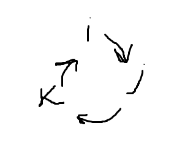

# Анализ. Вопросы. Семестр2

# Содержание

# Дополнительные определения

### Поле

**Поле** — алгебраическая структура с операциями сложения и умножения, такими что выполняется:

- Коммутативность сложения
- Ассоциативность сложения
- Существование нуля
- Существование обратного по сложению
- Коммутативность умножения
- Ассоциативность умножения
- Существование единицы
- Существование обратного по умножению *для ненулевых*
- 2 дистрибутивности

### Векторное пространство

**Векторное пространство** — алгебраическая структура, элементы которой называются **векторами**, и для которых определены операции сложения и домножения на скаляр из поля, такие что выполнеяется:

- коммутативность сложения
- ассоциативность сложения
- существование нуля
- существование обратного по сложению
- ассоциативность домножения на скаляр
- существование единицы
- 2 дистрибутивности

### Линейная комбинация

Выражение вида $\alpha_1\textbf x_1 + \dots + \alpha_n\textbf x_n$, где $\alpha_i$ — скаляры из поля, а $\textbf x_i$ — векторы пространства над этим полем, называется **линейной комбинацией**.

Если *все* коэфициенты равны нулю — линейная комбинация называется **тривиальной**.

### Линейная оболочка

**Линейная оболочка** (обозн. $L(\textbf x_1,\dots,\textbf x_n)$) —  множество всех линейных комбинаций с векторами.

### Линейная зависимость

Система векторов называется **линейно зависимой**, если существует их нетривиальная линейная комбинация, равная нулю. Иначе — **линейно независимой**.

### Базис

**Базис** векторного пространства  — максимальная по включению линейно независимая система векторов.

### Евклидово пространство

**Евклидово пространство** (обозн. $\mathbb E^n$) — векторное пространство $\R^n$ с введённым на ним скалярным произведением, таким что оно:

- линейно
- симметрично
- положительно определено

### Колебание функции

**Колебанием функции** $f$ на множестве $E$ называется $\sup \{|f(x) - f(y)|:x,y\in E\}$.
Обозн. $\omega(f, E)$

# Определения, примеры

## Матрица Грама; Ортонормированный базис

Пусть $(\textbf e_1,\dots,\textbf e_n)$ — базис [евклидова пространства](#euclidean-space) $V$.

Тогда матрица $\textbf G=(g_{ij})_{i,j=1..n}$, где $g_{ij}=\textbf  e_i\cdot \textbf  e_j$ называется **матрицей метрических коэфициентов** базиса или **матрицей Грама.**

Свойства матрицы Грама:

- Симметричность (из симметричности скалярного произведения)
- $\forall \textbf  u\ne\textbf 0:\textbf  u \cdot \textbf  u >  0 \implies g_{ij} \gt 0 \implies \det G > 0$

[**Базис**](#basis) называется **ортонормированным**, если его матрица Грама единична.

Базис называется **ортогональным**, если $\forall i\ne j: \textbf e_i \cdot \textbf e_j = 0$ 

## Ортогональное дополнение

**Ортогональное дополнение** (обозн. $U^\perp$) — множество всех векторов ортогнальных всем векторам из множества $U$.

Ортогональное дополнение всегда образует [векторное пространство](#vector-space).

## Группа афинных преобразований: сдвиги, повороты, растяжения

**Группа** — алгебраичесая система с операцией умножения, удовлетворяющей свойствам:

- ассоциативность
- существование единицы
- существование обратного

**Группа аффинных преобразованией $\mathbb R^2$** — преобразования в виде домножения на невырожденную матрицу 2х2, плюс некоторорый вектор. 

Когда говорят **преобразование**, подразумевают биективность, в противном случае это просто отображение, у него может буть домножение на вырожденную матрицу.

В векторном пространстве система координат — набор векторов, а в афинном — точка и базис

$\left(
{\begin{array}{cc}
x\\
y
\end{array}}
\right)
\to
\left(
{\begin{array}{cc}
10 & 0\\
0 & 10
\end{array}}
\right)
\left(
{\begin{array}{cc}
x\\
y
\end{array}}
\right)$ — **растяжение** (**дилотация**, **гомотетия**)

$\left(
{\begin{array}{cc}
x\\
y
\end{array}}
\right)
\to
\left(
{\begin{array}{cc}
\cos\phi & -\sin\phi\\
\sin\phi & \cos\phi
\end{array}}
\right)
\left(
{\begin{array}{cc}
x\\
y
\end{array}}
\right)$ — **поворот**

$\left(
{\begin{array}{cc}
x\\
y
\end{array}}
\right)
\to
\left(
{\begin{array}{cc}
\cos\phi & \sin\phi\\
\sin\phi & -\cos\phi
\end{array}}
\right)
\left(
{\begin{array}{cc}
x\\
y
\end{array}}
\right)$ — **отражение относительно прямой с угловым коэфициентом $\frac \phi 2$**

## Изометрия евклидова пространства. Ортогональная матрица

**Движением (изометрией) евклидова пространства** $V$ называется отображение $f:V\to V$ сохраняющее расстояние

Матрица, составленная из ортонормированного базиса называется **ортогональной**

## Собственные числа и векторы. Характеристический многочлен

Число $\lambda \in \mathbb C$ называется **собственным числом** матрицы $\textbf A$ с **собственным вектором** $\textbf v$, если $\textbf A\textbf v = \lambda\textbf v$

Для поиска полезно следующее равенство $\det(\textbf A - \lambda \textbf E) = 0$, оно является многочленом относительно $\lambda$, называемый **характеристическим многочленом** матрицы.

## Простое отношение тройки точек

В евклидовом пространстве для трёх точек *лежащих на одной прямой*, определим **простое отношение тройки точек** — число $\lambda$, такое что $\overline{AC} = \lambda\cdot \overline{CB}$.

## Кватернионы, сопряженный кватернион, модуль, чисто мнимый кватернион

$q \in \mathbb H \iff q = x + iy + jz + kw$ — **кватернион**

$i^2 = j^2 = k^2 = -1$

$ij = k\\jk = i\\ki=j$

Умножение кватернионов некоммутативно.

В **сопряженном** — вся мнимая часть с минусами.

$\overline{q_1\cdot q_2} = \overline{q_1} \cdot \overline{q_2}$

**Модуль кватерниона** — $|q|^2 = q \cdot \overline q = x^2 + y^2 + z^2 + w^2$

**Чисто мнимый кватернион** — кватренион, у котогого вещественная часть равна нулю.

Кватернионы соотвтетствуют матрицам поворота и работать с ними на практике эффективнее.

## Первообразная и интеграл. Неберущийся интеграл

**Первообразной** функции для данной $f(x)$ на данном промежутке называется такая функция $F(x)$, что $F'(x) = f(x)$, или эквивалентно $dF(x) = f(x)dx$ (на рассматриваемом промежутке).

Первообразная определена с точностью до добавления константы.

Общее выражение для всех первообразных данной функции $f(x)$ называется **неопределённым интегралом** и обозначается $\int{f(x)dx}$

Интеграл взять можно не всегда (выписать превообразную в элементарных функциях не всегда возможно).

## Основные табличные интегралы

- $\int x^ndx = \frac 1 {n+1} x^{n+1} + C$
- $\int \frac {dx} x = \ln x + C$
- $\int a^xdx = \frac {a^x} {\ln a} + C$
- $\int \cos x = \sin x + C$
- $\int \sin x  = -\cos x$
- $\int \frac {dx} {\sqrt{1-x^2}} = \arcsin x + C$
- $\int \frac {dx} {\sqrt{1+x^2}} \arccos x + C$
- $\int \frac {dx}{\sqrt{x^2 + \alpha}} = \ln |x + \sqrt{x^2 + \alpha}| + C$
- $\int \frac {dx} {\cos^2x} = \tg x + C$
- $\int \frac {dx} {\sin^2x} = -\ctg x + C$

## Определённый интеграл. Приращение первообразной

Разбиение на отрезки

**Определённый интеграл**  (обозн. $\int\limits_a^b f(x)dx$)— предел **интегральной суммы Римана**$\sum\limits_{k=1}^n f(\xi_k) \cdot \Delta x_k$, когда длина отрезков стремится к нулю

**Приращение первообразной** $F(x)$ на $[a,b]$ : $F(B) - F(A)$

## Формула Ньютона-Лейбница

$\int_a^bf(x)dx = F(b)-F(a)$  — то есть определенный интеграл непрерывной функции равен приращению первообразной на отрезке

## Свойства определенного интеграла

- $\int\limits_a^b f(x)dx = \int\limits_a^b f(t)dt$ (не зависит от переменной интегрирования)
- $\int\limits_a^bf(t)dt = -\int\limits_b^af(t)dt$
- $\int\limits_a^c f(x)dx = \int\limits_a^b f(x)dx + \int\limits_b^c f(x)dx$
- $\int\limits_a^b(\lambda f(x) + \mu g(x))dx = \lambda\int\limits_a^bf(x)dx + \mu\int\limits g(x)dx$ (линейность)
- $f(x) \ge_{[a,b]} 0 \Rightarrow \int\limits_a^b f(x)dx$ (монотонность)

## Разбиение отрезка, интегральная сумма Римана, интегрируемость по Риману, суммы Дарбу

Пусть $f:[a,b]\to\R$, $s(f,P) = \sum\limits_{i=1}^n\inf\limits_{y\in[x_{i-1},x_i]} f(y)(x_i - x_{i-1})$ — **нижняя сумма Дарбу
$S(f,P) = \sum\limits_{i=1}^n\sup\limits_{y\in[x_{i-1},x_i]} f(y)(x_i - x_{i-1})$** — **верхняя сумма Дарбу**

**Нижний интеграл Дарбу** — то есть супремум нижних сумм для всех разбиений

**Верхний интеграл Дарбу** — то есть нифинум верхних сумм для всех разбиений

Пусть $f: [a,b]\to\R$, говорят, что $f$ **интегрируема по Риману** и её интеграл равен $I$, когда её верхний и нижний интегралы Дарбу совпадают и равны $I$. Обозн. $f\in R([a,b])$

Множество всех функций интегрируемых по Риману на $[a,b]$ обозначается $R[a,b]$.

## Ступенчатые функции; Пример неинтегрируемой по Риману функции

Функция определённая на промежутке называется **ступенчатой**, если существует разбиение этого промежутка на конечное число промежутков, на каждом из которых она постоянна.

Пример неинтегрируемой по риману функции: $f(x) = \frac 1 x$ на $[0,1]$. Потому что верхняя сумма Дарбу бесконечна при любом разбиении ($\sup$ первого отрезка бесконечен).

## Равномерная непрерывность. Примеры

Функция называется **равномерно непрерывной** на множестве $E$ $\iff$
 $\forall \mathcal E > 0\ 
\exists \sigma\ 
\forall x_1, x_2\in E:\ 
|x_1-x_2| < \sigma \to
|f(x_1)-f(x_2)| < \mathcal E$.

Геометрический смысл равномерной непрерывности:

Если $f(x)$ равномерно непрерывна на $X$, то прямоугольник со сторонами $\sigma$ и $\mathcal E$ можно перемещать вдоль графика функции, так что график не пересечет горизонтальных сторон, а только вертикальные.

Картинка честно стырена

Пример: $f(x) = x^2$ не является равномерно непрерывной на $\R$.

Доказательство:

Рассмотрим $\mathcal E = 1,\ 
x_1 = \frac 1 \sigma + \frac \sigma 2,\ 
x_2 = \frac 1 \sigma$,

$|x_1-x_2| =
\frac 1 \sigma + \frac \sigma 2 - \frac 1 \sigma =
\frac \sigma 2 < \sigma$,

но: $|x_1^2 - x_2^2| = 
|x_1-x_2|\cdot|x_1 + x_2| = 
\frac \sigma 2 \cdot (\frac 2 \sigma + \frac \sigma 2) =
1 + \frac {\sigma^2} 4 \ge 1$ — притиворечие определению.

На пальцах: прямоугольничек по функции двигать не получится, так как парабола возрастает чем дальше тем быстрее.

Замечение: Любая *равномерно* непрерывная на множестве функция является на нём непрерывной.

## Несобственный интеграл. Степенная особенность

Пусть $[a,\omega)$ — конечный или бесконечный промежуток, $\forall [a,b] \in [a,\omega) : f\in R[a,b]$,

тогда определим $\int\limits_a^\omega f(x)dx = \lim\limits_{b\to\omega}\int\limits_a^b f(x)dx$ — **несобственный интеграл**.

**Свойства** несобственного интеграла:

- Если $\omega \in \R, f\in R[a,\omega]$, то значения интерала в римановом (собственном) и несобственном смысле совпадают.
- Линейность
- $c\in[a,\omega) \implies \int\limits_a^\omega f = \int\limits_a^c f + \int\limits_c^\omega f$
- Пусть $\phi:[a,\gamma) \to [a,\omega)$ — дифференцируемая, строго монотонная функция, $\phi(\alpha) = a$, $\lim\limits_{\beta\to\gamma} \phi(\beta) = \omega$, тогда $\int\limits_a^\omega f(x)dx =
\int\limits_\alpha^\gamma f(\phi(t))\phi'(t)dt$
- Формула интегрирования по частям

Степенные особенности:

- $\int\limits_{T>0}^\infty \frac {dx} {x^\alpha}$ — сходится при $\alpha > 1$
- $\int\limits_0^{\epsilon > 0} \frac {dx} {x^\alpha}$ — сходится при $\alpha < 1$

## Условно сходящийся интеграл. Пример.

Про несобственный интергал $\int\limits_a^\omega f(x)dx$ говорят, что он **сходится абсолютно**, если сходится интеграл $\int\limits_a^\omega |f(x)|dx$.

Несобственный интеграл, который сходится, но не абсолютно, называется **условно сходящимся**.

Пример условно сходящегося интеграла: $\int\limits_0^{\infty} \frac {\sin \alpha x\ dx} x =
sign\ \alpha \cdot\frac \pi 2$ — **Интеграл Дирихле**

## Ряды. Сходимость. Примеры.

**Сумма ряда** — предел последовательности частичных сумм, то есть

$\sum\limits_{i=1}^\infty a_i = \lim\limits_{n\to\infty} \sum\limits_{i=1}^n a_n$

Если такой предел существует в $\R$, то ряд называется **сходящимся**.

Пример сходящегося ряда: $\sum\limits_{n=1}^\infty \frac 1 {n^2} = \frac {\pi^2} 6$.

Пример расходящегося ряда $\sum\limits_{n=1}^\infty \frac 1 n\uparrow$ — **гармонический ряд**.

## Постоянная Эйлера-Маскерони

**Постоянная Эйлера-Маскерони** — предел разности между частичной суммой [гармонического ряда](#harmonic-series) и натуральным логарифмом числа, то есть:
$\gamma =
\lim\limits_{N\to\infty}
(\sum\limits_{n=1}^{N}
\frac 1 n - \ln N)
\approx 0.57721$.

Неизвестно, является ли рациональным.

Может быть выражена как интеграл: $\gamma = - \int\limits_0^\infty 
\frac {\ln x} {e^x} dx$

## Ортонормированная система функций

Функции $f(x), g(x)$ называются **ортогональными** на отрезке $[a,b]$,
если ${(\phi(x),\phi(x))} = \int\limits_a^b f(x)g(x)dx = 
0$.

**Нормой функции** на $\phi(x)$ на отрезке $[a,b]$ называется число, равное
$|\phi(x)| = \sqrt {(\phi(x),\phi(x))} = \sqrt {\int\limits_a^b \phi^2 (x) dx}$

Система функций $\phi_j(x)$ называется **ортонормированной**,
если функции системы попарно ортогональны и норма каждой из функций равна $1$, эквивалентно: $\int\limits_a^b\phi_i(x)\phi_j(x)dx = \begin{cases}
0,  &if \ i \ne j\\
1, & if \ i = j 
\end{cases}$

## Ряд фурье. Коэфициенты. Комплексный вид.

Пусть задана система функций $\phi_1(x), \phi_2(x), \dots$, тогда ряд вида $\sum\limits_{n=1}^\infty a_n\phi_n(x)$, где $a_n$  — некоторые вещественные или комплексные коэфициенты, **называется рядом по системе функций** $\phi_j(x)$.

Говорят, что $f(x)$ **разложима в ряд по системе функций**, если определены числа $a_n$, такие что, $\forall x\in Dom\ f : f(x) = \sum \limits_{n = 1} ^ \infty a_n\phi_n(x)$. 

Числа $a_n$ называются **коэфициентами Фурье**  функции $f$ по ортогональной системе, а ряд $\sum\limits_{n=1}^\infty a_n\phi_n(x)$ называется **рядом Фурье** функции $f$ по этой системе.

**Тригонометрическая система функций**: $1,\ \cos \frac \pi lx,\ \sin \frac \pi lx,\ \cos 2\frac \pi lx,\ \sin 2\frac \pi lx,\ \dots$

Она ортогональна на отрезке $[a,b]$, длины $l$.

При $l = \pi$, система называется **стандартной тригонометрической системой**.

**Тригонометрический ряд Фурье**:
$\frac {a_0} 2 + \sum\limits_{n=1}^\infty
a_n \cos {nx} + b_n \sin {nx}$, где коэфициенты вычисляются как:
$a_0 = \frac 1 l \int\limits_a^b f(x)dx$
$a_n = \frac 1 l \int\limits_a^b f(x) \cos n \frac \pi l x\ dx$
$b_n = \frac 1 l \int\limits_a^b f(x) \sin n \frac \pi l x\ dx$

Для разложения в такой ряд, надо сделать замену $\xi = \frac \pi l x$, где $l$ — длина периода $f(x)$ 

**Тригонометрическая система функций в комплексной форме**:
$\phi_v(x) = \cos v\frac \pi lx + i\sin v\frac \pi l x = e^{iv\frac \pi lx},\ v\in \Z$

**Тригонометрический ряд Фурье в комплексной форме**:
$\sum\limits_{v=-\infty}^\infty
c_v e^{iv\frac \pi l x}$, где коэфициенты:
$c_v = \frac 1 {2l} \int\limits_{-l} ^l f(x) e ^{-iv\frac \pi l x}dx$

## Ядро Дирихле

**Ядро Дирихле** — функция $D_n(x) =
\frac {\sin ((n + \frac 1 2) x)} {2\sin \frac x 2}$

Свойства:

- Четная
- $2\pi$-периодическая
- $\forall n \in \N: \int\limits_{-\pi} ^ \pi D_n(x)dx = \pi$

## Носитель функции, финитные функции

**Носитель функции $f$:**
$supp\ f =
\{x\in Dom f : f(x) \ne 0\}$

Функция на $\R$ называется **финитной**, ****если её носитель ограничен, то есть она обращается в ноль вне некоторого отрезка.

## Условие Липшица

Пусть $f$ определена в окрестности точки $x_0$, говорят, что $f$ **удовлетворяет условию Липшица** в $x_0$ порядка $\alpha > 0$, если
$\exists C, \sigma > 0\ \forall \xi\in(-\sigma,\sigma):\ |f(x_0 + \xi) - f(x_0)| < C|\xi|^\alpha$

## Интеграл Фурье, комплексная форма

**Интеграл Фурье**:
$\int\limits_0^\infty
[a(y)\cos yx + b(y)\sin yx]dy$, где:
$a(f,y) = \frac 1 \pi \int\limits_{-\infty}^\infty f(t)\cos y\ dt$,
$b(f,y) = \frac 1 \pi \int\limits_{-\infty}^\infty f(t)\sin y\ dt$

**Комплексная форма**: $v.p.\int\limits_{-\infty}^\infty
c(u)e^{iyx}du$, где
$c(f,y) =
\frac 1 2 (a(f,y)-ib(f,y)) =
\frac 1 {2\pi}\ v.p.\int\limits_{-\infty}^\infty f(t)e^{-iyt}dt$

## [Интеграл Дирихле](#dirichlet-integral)

## Условие Дини

💡 **Одностороннее условие Дини**:
$f-$абсолютно интегрируема на $\R$, в точке x имеет конечную одностороннюю производную $f(x_0\pm0)$ и функции $F_\pm(\xi) =
\frac {f(x_0\pm\xi) - f(x_0\pm0)}
\xi$  абсолютно интегрируема на $\xi\in(0,\sigma)$

## Преобразование Фурье: прямое, обратное, синус, косинус

Определённая на $\R$ функция называется **локально интегрируемой**, если она абсолютно интегрируема на любом конечном интервале.

Для любой локально интегрируемной функции $\phi(x)$, предел
$\lim\limits_{l\to\infty}\int\limits_{-l}^l \phi(x)dx$ называют **интегралом от $-\infty$ до $+\infty$ в смысле главного значения по Коши** и обозначают $v.p. \int\limits_{-\infty}^{+\infty}\phi(x)dx$.

**Преобразование Фурье**:
$f$ — абсолютно интегрируемая, выполняется [условие Дини](#dini-test),
$\forall x\in\R: f(x)=\int\limits_{-\infty}^\infty c(f,y)\cdot e^{iyx}\ dy$,
$c(f,y)=\frac 1 {2\pi} \int\limits_{-\infty}^\infty f(x)\cdot e^{-iyx}\ dx$,
$\hat f(\xi) = v.p. \frac 1 {\sqrt{2\pi}}
\int\limits_{-\infty}^\infty f(x)\cdot e^{-i\xi x} dx$ — **прямое преобразование Фурье**
$\tilde f(\xi) = v.p. \frac 1 {\sqrt{2\pi}}
\int\limits_{-\infty}^\infty f(x)\cdot e^{i\xi x} dx$ — **обратное преобразование Фурье**

Определим операторы:
$F: f \to \hat f$,

$F^{-1}: f \to \tilde f$

$\sqrt \frac {2} {\pi} \int\limits_0^\infty f(x)\cos yx\ dx = F_c[f]$ — **косинус-преобразование Фурье**

$\sqrt \frac {2} {\pi} \int\limits_0^\infty f(x)\sin yx\ dx = F_s[f]$ — **синус-преобразование Фурье**

# Теоремы и утверждения

## Теорема о независимости ортогональных векторов

💡 Теорема (**О независимости ортогональных векторов**):
Любые ненулевые взаимно ортогональные векторы $e_1,\dots, e_n\in V$ являются линейно независимыми. Если при этом размерность пространства $V$ совпадает с $n$, то векторы $\bar e$ образуют ортогональный базис в $V$.

Доказательство

Вторая часть следует из первой, докажем первую. Распишем линейную комбинацию базиса равную нулю. Докажем что она тривиальна. Домножим на $e_j$, все слагаемые кроме одного занулятся, коэфициент оставшегостя слагаемого ноль. Аналогично для всех коэфициентов.

## Процесс ортогонализации Грама-Шмидта

💡 Теорема (**Процесс ортогонализации Грама-Шмидта**):
****Для любой [ЛНЗ](#linear-dependence) системы векторов [евклидова пространства](#euclidean-space) существует ортонормированная система с такой же [линейной оболочкой](#linear-span)

Доказательство:

Первый вектор просто нормируем.
Пусть $\textbf  e_1',\dots \textbf  e_k'$ уже построена, хотим добавить $\textbf  e_{k+1}'$ чтобы он был ортогональным к уже построенным.
Для этого вычитаем из вектора $\textbf  e_{k+1}$ его проекции ($proj(\textbf a,\textbf  b) = \frac {\textbf  a \cdot \textbf  b} {\textbf  b \cdot \textbf  b} \textbf  b$) на все вектора $\textbf  e_1',\dots \textbf  e_k'$ и нормируем.

## Теорема о движении евклидова пространства

💡 Теорема (**О движении евклидова пространства**):
Отображение  $f: V\to V$является [движением](#euc-space-isometry) $\iff$$f(\textbf  x) = \textbf Q\textbf  x + \textbf  b$, где $Q$  — ортогональная матрица.

## Модуль собственных чисел ортогональных матриц

💡 Теорема (**Модуль собственных чисел ортогональных матриц**):
Собственные числа ортогональных матриц по модулю равны единице.

## Теорема Эйлера о вращении трёхмерного пространства

💡 Теорема (**Эйлера о вращении трёхмерного пространства**):
Любое [движение](#euc-space-isometry) трёхмерного тела, имеющее неподвижную точку — вращение вокруг некоторой оси.

## Характеристическое свойство аффинных преобразований

💡 Теорема (**Характеристическое свойство аффинных преобразований**): 
Пусть $\phi: \mathbb A\to\mathbb A$,
$\forall \nu: \overline{MN} = \nu\overline{MK} \implies \overline{\phi(M)\phi(N)} = \nu \overline{\phi(M)\phi(K)}$
Тогда $\phi$ — аффинное преобразование, верно и обратное.

## Вращение трёхмерного пространства с помощью кватерниронов

[Кватернион](#quaternion) здесь рассматривается как скаляр + трёхмерный вектор.

Пусть $q = w + xi + yj + zk = w + (x,y,z) = \cos \frac \alpha 2 + \textbf u\sin \frac \alpha 2$, где $\textbf u$ —единичный вектор,
тогда $q\textbf v \overline q$ — вращает вектор $\bf v$ на угол $\alpha$ вокруг оси $\bf u$.

## Свойства неопределённого интеграла

- Дифференциал неопределенного интеграла равен подинтегральному выражению
- Неопределённый интеграл от дифференциала непрерывно дифференцируемой функции равен самой функции с точностью до константы
    - $\int{\frac 1 {1+x^2}dx} = \arctg x + C$
    - $\int {\frac {\arctg^2 x} {1+x^2} dx} = \frac 1 3 \arctg^3 x + C$
- $\int{(\lambda f(x) + \mu g(x))dx} =  \lambda \int f(x)dx + \mu \int g(x)dx$ (линейность)

## Теорема Коши о неопределённом интеграле

💡 **Теорема (Коши о неопределённом интеграле)**:
Для любой функции непрерывной на интервале существует первообразная.

## Формулы замены переменной и интегрирования по частям

$\int f(x) dx = \int f(x(t))d\phi(t) = \int f(x(t))\phi'_t(t)dt$ — **формула замены переменной**

$\int vdu=v\cdot u-\int udv$ — **формула интегрирования по частям**

## Теорема о независимости определённого интеграла

💡 Теорема (**О независимости определённого интеграла**):
[Определённый интерграл](#definite-integral) от непрерывной функции не зависит от выбора первообразной для подинтегральной функции.

## Теорема об интегрируемости по Риману

💡 Теорема (**Об интегрируемости по Риману**):
Ограниченная функция $f: [a,b]\to\R$ [интегрируема по Риману](#definite-integral) $\iff$
Существуют пределы $\lim\limits_{\lambda(P)\to0} s(f;P)$ и $\lim\limits_{\lambda(P)\to0} S(f;P)$ и они равны.

## Необходимое условие интегрируемости

💡 Теорема (**Необходимое условие интегрируемости**):
Для того чтобы функция $f$ определённая на $[a,b]$ была интегрируема по Риману, *необходимо* чтобы она была ограничена

## Достаточное условие интегрируемости

💡 Теорема (**Достаточное условие интегрируемости**):
Для того, чтобы ограниченная на отрезке функция была интегрируема, *достаточно*, чтобы:
$\forall \mathcal E > 0\ \exists \sigma > 0\ \forall P, \lambda(P) < \sigma:
\sum\limits_{i=1}^n \omega(f, [x_{i-1}, x_i])\cdot (x_i - x_{i-1}) < \mathcal E$, где
$P$ — разбиение, $\lambda(P)$ — максимальная длина отрезка в разбиении, $\omega(f,[a,b])$ — [колебание](#oscillation)

## Интегрируемость непрерывной функции

💡 Теорема (**Интегрируемость непрерывной функции**):
Если функция непрерывна на промежутке, то она на нём интегрируема.

## Свойства интегрируемых по Риману функций

Пусть $f,g \in R[a,b]$, тогда:

- $f+g \in R[a,b]$
- $f\cdot g \in R[a,b]$
- $f\cdot \alpha \in R[a,b], \alpha\in \R$
- $|f| \in R[a,b]$
- $f|_{[c,d]} \in R[c,d], [c,d]\subset[a,b]$

## Интегральное неравенство треугольника

💡 Теорема (**Интегральное неравенство треугольника**):
Если $a<b, f\in R[a,b]$, то
$|\int\limits_a^bf(x)dx| \le
\int\limits_a^b|f(x)|dx$

## Теорема о монотонности интеграла и 2 следствия из неё

💡 Теорема (**О монотонности интеграла**):
Пусть $f,g\in R[a,b]$, и $\forall x\in[a,b]:f(x)\le g(x)$
Тогда $\int\limits_a^bf(x)dx\le
\int\limits_a^bg(x)dx$

💡 Теорема (**О монотонности интеграла — следствие 1**):
Пусть $f\in R[a,b]$, и $\forall x\in[a,b]:m\le f(x)\le M$
Тогда $m(b-a)\le\int\limits_a^bf(x)dx\le M(b-a)$

💡 Теорема (**О монотонности интеграла — следствие 2**):
Пусть $f\in R[a,b]$, и $m = \inf\limits_{x\in [a,b]} f(x)$, $M = \sup\limits_{x\in[a,b]} f(x)$
Тогда $\exists \mu\in[m,M]:\int\limits_a^bf(x)dx = \mu(b-a)$

## Теоремы о среднем (первая и о произведении)

💡 Теорема (**Первая теорема о среднем**):
Если $f$ непрерывна, то $\exists \xi\in[a,b]:
\int\limits_a^bf(x)dx = f(\xi)(b-a)$

💡 Теорема (**О среднем для произведения**):
Пусть $f,g\in R[a,b], m = \inf f(x), M = \sup f(x)$
Если $g\ge 0$ или $g \le 0$, то
$\exists \mu\in[m,M]: \int\limits_a^b(f\cdot g)(x)dx =
\mu \int\limits_a^bg(x)dx$

## Формула Симпсона

**Формула Симпсона**:

$$
\int\limits_a^bf(x)dx \approx 
\frac {b-a} 6 \cdot(f(a) + 4 \cdot (\frac {a+b} 2) + f(b))
$$

## Остаток ряда Тейлора в интегральной форме

$f(x) = \sum\limits_{k=0}^{r-1} \frac {f^{(k)}(a)}{k!}(x-a)^K + R(x)$, где
$R(x) = \frac 1 {(r-1)!}
\int\limits_a^x
(x-t)^{r-1}f^{(r)}(t)dt$ — **остаток ряда Тейлора в интегральной форме**

## Теорема об одновременной сходимости и расходимости интегралов

💡 Теорема (**Об одновременной сходимости и расходимости интегралов**):
Пусть функции $f, g$ неотрицательны на $[a,b)$ и выполнеяется $f(x) =_{x\to b} O(g(x))$
Тогда, если $\int\limits_a^bg(x)dx$ сходится, то и $\int\limits_a^bf(x)dx$ тоже сходится.

## Критерий Коши сходимости несобственного интеграла

💡 Теорема (**Критерий Коши сходимости несобственного интеграла**):
Если $f(x)$ определена на $[a,\omega)$ и интегрируема на любом $[a,b]\subset[a,\omega)$, то
интеграл $\int\limits_a^\omega f(x) dx$ сходится $\iff$$\forall \mathcal E>0\ 
\exists B \in[a,\omega)\ 
\forall b_1,b_2\in [B, \omega]:
|\int\limits_{b_1}^{b_2}f(x)dx|<\mathcal E$

## Интегральный признак сходимости ряда

💡 Теорема (**Интегральный признак сходимости ряда**):
Если $f(x)$ — неотрицательная, невозрастающая, интегрируемая на каждом отрезке dom, определённая на $[1,+\infty)$, то
$\sum\limits_{n=1}^\infty f(x)$ и $\int\limits_1^\infty f(x) dx$ сходятся и расходятся одинаково

## Вторая теорема о среднем

💡 Теорема (**Вторая теорема о среднем**):
Если $f$ монотонна на $[a,b]$, а $g\in R[a,b]$, то
$\exists \xi\in[a,b]:
\int\limits_a^bf(x)g(x)dx =
f(a)\int\limits_a^\xi g(x)dx +
f(b)\int\limits_\xi^b f(x)dx$

## Признак Дирихле

💡 Теорема (**Признак Дирихле**):
Пусть функция $f(x)$ интегрируема на любом отрезке $[\alpha, \eta]$, $F(\eta) = \int\limits_\alpha^\eta f(x)dx$ ограничена на $[\alpha, \infty)$, а функция $g(x)$ монтонна и $\lim\limits_{x\to\infty}g(x) = 0$.
Тогда $\int\limits_\alpha^\infty f(x)\cdot g(x)\ dx$ сходится.

## Признак Абеля

💡 Теорема (**Признак Абеля**):
Пусть $f$ интегрируема на любом конечном $[\alpha,\eta]$ и на $[\alpha, \infty)$ интеграл от $f$ сходится, а функция $g$ монотонна и ограничена,
Тогда $\int\limits_\alpha^\infty f(x)\cdot g(x)\ dx$ сходится.

## Необходимое условие сходимости ряда. Лемма о количестве членов ряда

💡 Теорема (**Необходимое условие сходимости ряда**):
Если ряд $\sum\limits_{n=1}^\infty U_n$ сходится, то $\lim\limits_{n\to\infty} U_n = 0$

💡 Лемма (**О количестве членов ряда**):
Если в ряде отбросить конечное число первых членов, то полученный ряд сходится или расходится одновременно с исходным

## Признак сравнения рядов

💡 Теорема (**Признак сравнения рядов**):
Если члены ряда неотрицательны и не превосходят членов сходящегося ряда, то исходный так же сходится.

## Теорема об одновременной сходимости и расходимости рядов

💡 Теорема (**Теорема об одновременной сходимости и расходимости рядов**):
Если $\forall n\in \N: a_n > 0,\ b_n > 0$, и, $\exists N\in \N\ \forall n > N:
\frac{a_{n+1}}{a_n} \le
\frac{b_{n+1}}{b_n}$, 
то из сходимости ряда  $\sum b_n$ следует сходимость ряда $\sum a_n$,
из расходимости ряда $\sum a_n$ следует расходимость ряда $\sum b_n$

## Признак Коши, предельная форма

💡 Теорема (**Признак Коши**):
Если $\exists N\in \N\ \forall n\in\N, n > N:\sqrt[n]{a_n} < q$, где $0<q<1$,
то ряд $\sum\limits_{n=1}^\infty a_n$ сходится.
Если $\forall n\in\N:\sqrt[n]{a_n} \ge 1$, то ряд расходится.

💡 Следствие (**Признак Коши в предельной форме**):
Пусть ряд $\sum\limits_{n=1}^\infty a_n$ такой, что $\lim\limits_{n\to\infty}\sqrt[n]{a_n} = C$.
Тогда, при $C < 1$ — ряд сходится, а при $C > 1$ — расходится.

## Признак Даламбера, предельная форма

💡 Теорема (**Признак Даламбера**):
Если $\exists N\in\N\ \forall n\in\N, n > N:
\frac{a_{n+1}}{a_n} \le q$, где $0< q < 1$,
то $\sum a_n$ сходится.

💡 Следствие (**Признак Даламбера в предельной форме**):
Если$\lim\limits_{n\to\infty} \frac{a_{n+1}}{a_n} = C$, то при $C > 1$ — $\sum a_n$ расходится, а при $C < 1$ — сходится

## Признак Лейбница, пример

💡 Теорема (**Признак Лейбница**)
Если $a_n$ монотонно убывает к нулю при $n\to\infty$, то ряд $\sum\limits_{n=1}^\infty (-1)^{n-1}\cdot a_n$ сходится

Пример: $\sum\limits_{n=1}^\infty(-1)^{(n-1)}\cdot \frac 1 n$ — сходится

## Лемма об ортогональности тригонометрических функций

💡 Лемма (**Об ортогональности тригонометрических функций**):
[Система тригонометрических функций](#trig-function-system) ортогональна на $[a,b]$ длины $l$

## Теорема о приближении абсолютно интегрируемых функций финитными

💡 Теорема (**О приближении абсолютно интегрируемых функций финитными**):
Если функция $f$ абсолютно интегрируема на промежутке $\Delta$,
то $\forall \epsilon>0\ 
\exists$финитная ступенчатая функция $\phi$, такая что $supp\ \phi \subset \overline\Delta$,
$\int\limits_\Delta|f(x) - \phi(x)|dx < \epsilon$

## Следствие о непрерывности первообразной

💡 Следствие (**О непрерывности первообразной**):
Если функция $f$ абсолютно интегрируема на промежутке $\Delta$, то функция
$F(x)=\int\limits_a^x f(x)dt$, где $a\in\Delta$
Непрерывна на замыкании $\overline \Delta$ этого промежутка

## Теорема Римана об осцилляции

💡 Теорема (**Римана об осцилляции**):
Если функция $f$ абсолютно интегрируема на $\Delta$, то
$\lim\limits_{\lambda\to\infty}\int\limits_\Delta f(x)e^{e\lambda x}dx = 0$

## Лемма о коэффициентах Фурье функции и её производной

💡 Лемма (**О коэффициентах фурье**):
Коэфициенты Фурье любой абсолютно интегрируемой функции стремятся к нулю при $v\to\pm\infty$.

## Теорема об асимптотике коэффициентов Фурье

💡 Теорема (**Об асимптотике коэффициентов Фурье**):
Если функция $f(x), x\in (-\pi,\pi)$ имеет непрерывную и абсолютно интегрируемую производную,
то $c_\nu(f) \underset{\nu\to\infty}= O(\frac 1 \nu)$,
Если, кроме того, $f(x)$ напрерывна на отрезке $[-\pi,\pi]$ и $f(-\pi) = f(\pi)$,
то $c_\nu(f) = \frac 1 {\nu i}(f'), \forall \nu \ne 0$

## Признак Липшица сходимости ряда Фурье

💡 Теорема (**Признак Липшица сходимости ряда Фурье**):
Если $f$ абсолютно интегрируемя на $(-\pi,\pi)$ и в $x_0$ удовлетворяет [условию Липшица](#lipschitz) порядка $\alpha >0$, то её ряд Фурье в точке $x_0$ сходится к $f(x_0)$

## Признак Дини

💡 Теорема (**Признак Дини сходимости интеграла Фурье**):
Если абсолютно интегрируемая на $\R$ функция $f$ в точке $x_0\in\R$ удовлетворяет [одностороннему условию Дини](#dini-test), то её интеграл Фурье в точке $x_0$ сходится к $\frac {f(x_0 + 0) + f(x_0 - 0)} 2$

## Свойства преобразования Фурье

Свойства преобразования Фурье ($\forall a\in \R, \forall \alpha > 0$):

- $F[f(\alpha x)] = \frac 1 \alpha f_1 (\frac \xi \alpha)$
- $F^{-1}[f(\alpha x)] = \frac 1 \alpha f_2 (\frac \xi \alpha)$
- $F[f(x+\alpha)] = e^{i\alpha\xi}f_1(\xi)$
- $F^{-1}[f(x+\alpha)] = e^{-i\alpha\xi}f_2(\xi)$

## Теорема о композиции прямого и обратного преобразований Фурье

💡 Теорема (**О композиции прямого и обратного преобразований Фурье**):
$f$ — абсолютно интегрируемая, непрерывная, выполняется условие Дини, тогда:
$F^{-1}[F[f]] = f$
$F[F^{-1}[f]] = f$

## Лемма об асимптотике абсолютно интегрируемой функции

## Преобразование Фурье производной

💡 Теорема (**Преобразование Фурье производной**):
Если непрерывная и абсолютно интегрируемая функция $f$ является кусочно-гладкой на любом отрезке $[a,b]\in\R$, а $f'$ абсолютно интегрируема, то:
$F[f'] = iyF[f]$

## Формула Планшереля, её смысл

$||f|| = ||\hat f||$

## Равенство Парсеваля

Пусть $||x|| = \sqrt {(x,x)}$

$||x||^2 = \sum\limits_{k=1}^\infty|(x,e_k)|^2$

## Теорема Котельникова

На пальцах, теорема утверждает, что для передачи напрерывного сигнала с ограниченным спектром по каналу связи можно не передавать все значения.