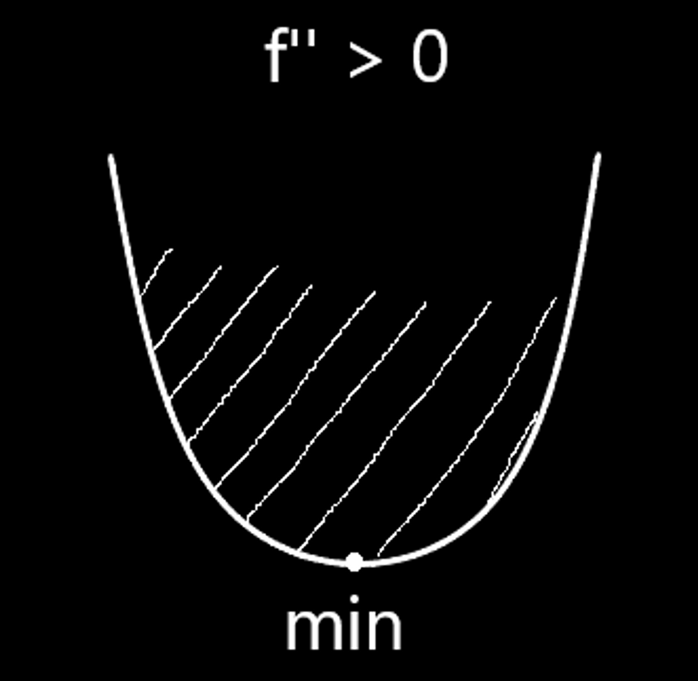

# ЛЕКЦИЯ 10

## Многочлен Тейлора

Пусть функция $f$ имеет $n \in \mathbb N$  производных в точке $x_0$ . ( $0! = 1$ )
$\mathcal P_n(x) - \sum\limits^n_{i = 0} \Large \frac {f^{(i)}(x_0)} {i!}\ \normalsize(x - x_0)^i = f(x_0) + f'(x_0)(x - x _0)^1 + \Large \frac {f''(x_0)} {2!}\normalsize(x - x_0)^2 +$ 
$+ \large \frac {f'''(x_0)} {3!} \small (x - x_0) ^ 3 + ...+ \large \frac {f^{(n)}(x_0)} {n!} \small (x - x_0)^n$ 

$\mathcal P'_n = f'(x_0) \cdot1 + f''(x_0)(x-x_0)^1 + \Large \frac {f'''(x_0)} {2!}\normalsize(x - x_0)^2 + ... +$ 
$+\Large \frac {f^{(n)}(x_0)} {(n-1)!}\normalsize(x - x_0)^{n-1}$

$\vdots$
$\mathcal P^{(i)}_n(x_0) = f^{(i)}(x_0)$
Ряд Маклорена - $x_0 = 0$.

$e^x = 1 + x + \frac {x^2} {2!} + \frac {x^3} {3!} + ... + \frac {x^n} {n!}$

$\sin x = x - \frac {x^3} {3!} + \frac {x^5} {5!} - \frac {x^7} {7!}$

$\cos x = 1 - \frac {x^2} {2!} + \frac {x^4} {4!} - \frac {x^6} {6!}$

$\arctg x = x - \frac {x^3} {3} + \frac {x^5} {5} - \frac {x^7} {7}$ 

$(1+x)^p - 1 + px + \frac{(p-1)px^2}{2!} + \frac{(p-2)(p-1)px^3}{3!}$ 

$\int \large \frac 1 {1 + x^2} = \normalsize \int ( 1 - x^2 + x^4 - x^6 + x^8 - ...)$

$\ln (1+x) = x - \frac {x^2} {2} + \frac {x^3} {3} - \frac {x^4} {4} + ...$

## Теорема Лопиталя

⭐ Предел отношения двух бесконечно малых или больших величин равен пределу отношения их производных, если последний существует.
$\lim\limits_{x \to x_0} \large \frac {\phi(x)} {\psi(x)} = \normalsize \lim\limits_{x \to x_0} \large \frac {\phi'(x)} {\psi'(x)}$

Доказательство:

$\phi, \space \psi \longrightarrow 0$

$\lim\limits_{x \to x_0} \large \frac {\phi(x)} {\psi(x)} = \normalsize \lim\limits_{x \to x_0} \large \frac {\phi(x) - \phi(x_0)} {\psi(x) - \psi (x_0)} \normalsize= \lim\limits_{x \to x_0} \large \frac {\large \frac {\psi(x) - \psi (x_0)} {x - x_0}} {\large \frac {\psi(x) - \psi (x_0)} {x - x_0} } \normalsize = \frac {\lim\limits_{x \to x_0} \large \frac {\phi(x) - \phi(x_0)} {x - x_0}} {\lim\limits_{x \to x_0} \large \frac {\psi(x) - \psi (x_0)} {x - x_0}} \normalsize = \Large \frac {\phi'(x_0)} {\psi'(x_0)}$.

Пример:

1. $\lim\limits_{x \to \infty} \large \frac {x^2} {e^x} \normalsize = \lim\limits_{x \to \infty} \large \frac {2x} {e^x} \normalsize = \lim\limits_{x \to \infty} \large \frac 2 {e^x} = 0$.
2. $\lim\limits_{x \to \frac \pi 2} (\sin x)^{\tg x} =  \lim\limits_{x \to \frac \pi 2} \ln(\sin x \cdot \tg x) = \lim\limits_{x \to \frac \pi 2} \Large \frac {\ln \sin x} {\ctg x} \normalsize = \lim\limits_{x \to \frac \pi 2}  \frac {\large \frac 1 {\sin x} \cdot \normalsize \cos x} {- \large \frac 1 {\sin^2x}} = \lim\limits_{x \to \frac \pi 2} (\cos x \cdot \sin x) = 0$

---

$\mathcal P_n(x) = \sum\limits^n_{j = 0} \large \frac {f^{(j)}(p)} {j!} \normalsize (x - p)^j$ 

$f(x) = \mathcal P_n(x) + \mathcal R_n(x)$

## Теорема Пеано

⭐ $\mathcal R_n(x) \underset{x \to x_0} = o(|x - p|^n)$

Доказательство:

$\lim\limits_{x \to p} \large \frac {f(x) - \mathcal P_n(x)} {(x-p)^n} \overset { Лопиталь \space n \space раз} = \space \normalsize \lim\limits_{x \to p} \large \frac {f^{(n)}(x) - f^{(n)}(p)} {n!} = 0$.

## Лемма о степенной оценке приращения

⭐ Если функция непрерывна на отрезке $[p, q]$  и  $\forall \space t \in (p, q)$ выполнено:
$|g'(t)| \leq c \cdot |t - p|^{\large s}$ ,   где  $\large s > -1$ ,   то 
$|g|^t_p| \leq \large \frac c {s + 1} \normalsize |t - p|^{s + 1}$    $\forall \space t \in [p, q]$.

Доказательство:

$h(x) := \Large \frac c {s + 1} \normalsize |t - p|^{s+1}$
$|h'(x)| = c \cdot |x-p|^s$   $\forall \space x \in \mathbb R \space \backslash \space p$

По Теореме о приращениях 
$\forall \space t \in [p, q]$     $|g|^t_p| \leq |h|^t_p|$.

## Теорема Оценка остатка в форме Лагранжа

⭐ Если функция $f$  дифференцируема $n + 1$ раз на $[p ,q ]$ и $|f^{(n+1)}(t)| \leq C  \space \space$ 
$\forall \space t \in (p, q]$ ,  то 
$|f(x) - \mathcal P_n(x)| \leq \large \frac c {(n+1)!} \normalsize |x - p| ^ {n+1}$ .

Доказательство:

$\mathcal R_n(x) = f(x)  - \mathcal P_n (x)$

$\mathcal R ^ {(j)}_n (p) = 0$         $j = 0 ... n$
$|\mathcal R^{(n+1)}_n (t)| = |f^{(n+1)(t)}| \leq c$

Далее $n$  раз применяем Лемму о степенной оценке
$|\mathcal R_n(x)| \leq \large \frac c {(n +1 )!} \normalsize (x - p)^{n + 1}$

## Экстремумы

$f = f(x)$

1. $df = 0 \space \Longleftrightarrow \space f'(x) = 0$
2. $d^2f \gtrless 0$

