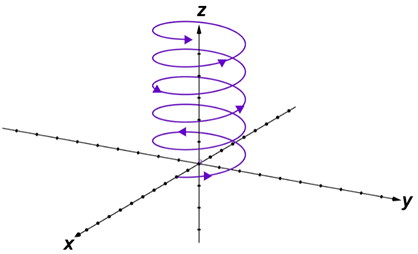

# ЛЕКЦИЯ 6

## Функции одного переменного

$f : X \longrightarrow Y$

$Dom$  — область определения функции

$Dom \space f$ — те  $x \in X$ , на которых отображение $f$ определено.

$Dom \sqrt {} = \mathbb R_{\geq0} = \{ x \in \mathbb R : x\geq 0 \}$

$\forall x \in Dom \space f \space \space \exists! \space y \in Y$  , такое что $f(x) = y$. 

$graf(f) = \{ (x,y) \in X \times Y : f(x) = y \}$

$Im(f) = \{ y \in Y : \exists x \in X \space \space y = f(x) \}$

$f = \uparrow^2(x) = x^2$             $Im(\uparrow^2) = \mathbb R_+$

$f^{-1} : Y \longrightarrow X$ — обратное к $f$ отображение      $f^{-1} \neq \frac 1 f$

Если $\forall x \in X , \space \forall y \in Y :$        $f'(f(x)) = x , \space  \space  \space  \space  \space  \space f(f'(y)) = y$ 

$\exp(x) = e^x$

$\exp : \mathbb R \longrightarrow \mathbb R_+$

$\ln : \mathbb R_+ \longrightarrow \mathbb R$

$e^{\ln y} = \exp(\ln(y)) = y , \space \space y \in \mathbb R_+$

$\ln e^x = x$

## Группа  $< G, \ast>$

$\exists$ единица $e$ — нейтральный элемент

$\forall g \in G \space \space \space e \ast g = g \ast e = g$

Пример:

$< \mathbb Z, +>$

$e = 0$  — нейтральный элемент

## Композиция

> $g : X \longrightarrow Y \\
f : Y \longrightarrow Z$
Тогда их композицией называется функция 
$f \circ g : X \longrightarrow Z$
$(f \circ g)(x) = f(g(x))$
> 

Пример 

$e^{\tg x} = \exp(\tg (x)) = (\exp \circ \tg) (x)$

$X = (- \frac \pi 2, \frac \pi 2)$

$\tg X \longrightarrow \mathbb R$ — взаимно однозначное отображение

$f = \exp  : \mathbb R \longrightarrow \mathbb R_+$

$\exp \circ \tg \space (- \frac \pi 2, \frac \pi 2) \longrightarrow \mathbb R_+$

> Отображение $f : X \longrightarrow Y$  называется взаимно однозначным, если 
$\forall y \in Y \space \space \exists! \space x \in X \space \space \space f(x) = y$
> 

$Id : X \longrightarrow Y$
$Id(x) = x$ — тождественное отображение

$\exp \circ \ln = Id$ 

$x: \mathbb N \longrightarrow \mathbb R$ — последовательность

$\left\{ \begin{array}{rcl} x(t) = \cos t \\ y(t) = \sin t \\ z(t) = t  \end{array} \right.$        $\left( \begin{array}{rcl} x \\ y \\ z\end{array}\right)$
$(t)$ = $\vec {\mathcal V} (t)$ 

$\vec {\mathcal V} : \mathbb R \longrightarrow \mathbb R ^3$

---

> $f$  монотонна, если 
$x \leq (<) y \implies \space \space \space \space \space f(x) \leq (<) f(y)$   — возрастающая
                                 либо    $f(x) \geq (>) f(y)$ —  убывающая.
> 

Пример:

$\exp$ ,  $\ln$ — возрастают

**Классификация элементарных функций одного переменного**

1. Многочлен
$P_m(x) = a_0 \cdot x^m + a_1 \cdot x^{m-1} + ... + a_m$ ,  $m \in \mathbb N$
2. Дробно-рациональные функции
$R(x) = \frac {P_m(x)} {Q_m(x)}$
3. Иррациональные функции ($\sqrt {\space \space}$)
Рациональные $\cup$ Иррациональные  =  Явные алгебраические функции
4. Алгебраические  функции
$y^5 + 3y^4 + y - x^2 = 0$
в общем случае $y$  не выражается в радикалах через $x$
5. Трансцендентные функции
$a^x \\ \ln_a y \\ \sin x, \space \cos x, \space \tg x, \space \ctg x \\ \arcsin x, \space \arccos x, \space \arctg x, \space \arcctg x$

> Элементарные функции - это алгебраические, трансцендентные и их всевозможные конечные композиции.
> 

**Неэлементарные функции:**
Интеграл Дирихле:

$f(t) = \int\limits_0^t \frac {\sin x} x dx$   —  неберущийся интеграл. Нельзя выразить в элементарных функциях.

## Теория предела

> Число $A$ называется пределом функции  $f(x)$  при  $x \longrightarrow a$  и записывается $f(x) \space {\overrightarrow {\scriptsize x \to a} } \space \large A$  или  $\lim\limits_{x \to a} f(x) = A$  если  $\forall \varepsilon > 0$  существует проколотая 
$\delta$-окрестность  $U$  точки  $a$ ,  $U = (a-\delta, a+\delta)\backslash\{a\}$ ,  такая что
 $\forall x \in U \space \space \space |f(x) - A| < \varepsilon$.
> 

Примеры:

$f(x) = x^2 \\ \lim\limits_{x \to 2} f(x) = 4$

$f(x) = \left\{ \begin{array}{rcl} \frac {\sin x} x , \space x \neq 0  \\ 1, \space x = 0\end{array} \right.$

${\large \frac 1 x}$ не имеет предела при $x \to 0$
