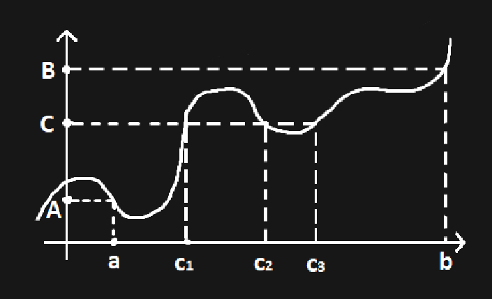

# ЛЕКЦИЯ 7

## Теорема о единственности предела

⭐ Если $f(x) \space {\overrightarrow {\scriptsize x \to x_0} } \space \large A$  и  $f(x) \space {\overrightarrow {\scriptsize x \to x_0} } \space \large B$ ,  то $A = B$.

Доказательство:

$|A-B| = |A - f(x) + f(x) - B| \leq |A - f(x)| + |f(x) - B| \leq \bullet$
$\exists \delta_1 = \delta_1(\varepsilon)$, т.ч.  $|x-x_0| \leq \delta_1 \space \space \space \space |f(x) - A| \leq \frac \varepsilon 2$

$\exists \delta_2 = \delta_2(\varepsilon)$, т.ч.  $|x-x_0| \leq \delta_2$ , то  $|f(x) - B| \leq \frac \varepsilon 2$ 

$\delta_3 = \min(\delta_1, \delta_2) \implies \space \space \bullet \leq \frac \varepsilon 2 + \frac \varepsilon 2 = \varepsilon \implies A = B$

## Теорема о пределе монотонной функции

⭐ Если $f(x)$ монотонна на интервале $S$, находящемся строго по одну сторону от точки $p$, то $\exists \lim\limits_{x \to p} f(x)$, а именно :
1. $f$ возрастает и $S = (a, p)$,  то     $\lim\limits_{x \to p} f(x) = \sup f(x), x \in S$
2. $f$  убывает и $S = (a, p)$,  то     $\lim\limits_{x \to p} f(x) = \inf f(x), x \in S$
3. $f$ возрастает и $S = (p, b)$ аналогично
4. $f$ убывает и $S = (p, b)$ аналогично

Доказательство:

1. Предположим $h = \sup(f(x) >  -\infty$ — конечное число, $\space x \in S$.
Тогда $\exists$ точка $s \in S$, т.ч. $h - \varepsilon < f(s)$, т.к. $h - \sup$.
Положим $V := (s, p+1) \in \mathcal N(p)$.
$\forall x \in S \cap V = (s, p)$        $h - \varepsilon < f(s) \leq f(x) \leq h$ (т.к. $f$ возрастает) $\implies \\ \implies \lim\limits_{x \to p} f(x) = h$

Пункты 2, 3, 4 доказываются аналогично.

> Односторонний предел
$\lim\limits_{x \to \frac \pi 2 -0} \tg(x) = + \infty$              $\lim\limits_{x \to \frac \pi 2 +0} \tg(x) = - \infty$
> 

## Теорема о сумме и произведении пределов.

⭐ Если $f(x) \space {\overrightarrow {\scriptsize x \to x_0} } \space \large A$  и   $g(x) \space {\overrightarrow {\scriptsize x \to x_0} } \space \large B$,  то 
$(f+g)(x) \space {\overrightarrow {\scriptsize x \to x_0} } \space \large A+B$             $(f \cdot g)(x) \space {\overrightarrow {\scriptsize x \to x_0} } \space \large (A \cdot B)$

Доказательство:

$|f + g - (A + B)| \leq |f - A| + |g - B| \leq \frac \varepsilon 2 + \frac \varepsilon 2 = \varepsilon$ 

$|f \cdot g - A \cdot B - f(x) \cdot B + f(x) \cdot B| \leq |f(x) (g(x) - B)|+ |(f(x)- A)B| \to 0$

## Критерий Гейне

⭐ Функция $f(x)$  имеет предел при $x \to p$ по множеству $S \subset Dom (f)  \Longleftrightarrow$
$\Longleftrightarrow \forall$  последовательность $S_n \in S \space {\overrightarrow {\scriptsize n \to \infty} } \space {\large p} \space \space f(x)$  переводит в сходящуюся последовательность $f(S_n)$.

## Теорема Больцано-Коши о промежуточных значениях

⭐ $f : [a, b] \to \mathbb R$  — непрерывная функция. $f(a) = A, \space \space f(b) = B, \space \space A = B$.
$\forall \space C \in [A, B] \space \space \exists \space c \in [a,b]$, т.ч.  $f(c) = C$.

Доказательство:

$g(x) = f(x) - C \\ g(a) - A - C < 0 \\ g(b) = B - C > 0$

$x_o = \frac {a+b} 2$

$g(x_0) = \left\{ \begin{array}{rcl} 0, OK \\ > 0, \space \implies рассм. \space [a, x_0] = [a_i, b_i] \\ < 0, \space \implies рассм. \space [x_0, b] = [a_i, b_i] \end{array} \right.$

и т.д.

Получаем последовательность вложенных отрезков Контора. 

$\exists \space c = \bigcap [a_n, b_n]$

$g(a_n) < 0 \\ g(b_n) > 0 \\ g(c) = 0$.

Пример:

$f(x) = x^{2k + 1} + a_1x^{2k} + a_2x^{2k-1} + ... + a_{2k+1}$ — полином нечётной степени

Если взять достаточно большое число $-\mathbb R$

$f(- \mathbb R) < 0 , \space \space f(\mathbb R) > 0$

$|R^{2k+1}| > |a_1|R^{2k} + |a_2|R^{2k-1} + ... + |a_{2k+1}|$

$A = \max \{|a_1|,...,  |a_{2k+1}|\}, \space \space \space R > 2k \cdot A$

## Асимптотические отношения

> Говорят, что $\psi(x) = o(\phi(x))$ при $x \to a$, если $\phi(x) = \psi(x) \cdot \alpha(x)$ , где $\alpha(x) {\overrightarrow {\scriptsize x \to a} } \space \large 0,$  т.е. $\lim\limits_{x \to a} \frac {\psi (x)} {\phi (x)} = 0$.
> 

Примеры:

1. $\chi^{k+n} = o(\chi^n) \space при \space x \to 0, \space \space \space n, k > 0\in \mathbb N$
    
    $\chi ^ n = o (\chi ^{k+n}) \space при \space x \to \infty$
    
2. $f(x) = x^{2k + 1} + a_1x^{2k} + a_2x^{2k-1} + ... + a_{2k+1}$
    
    $h(x) = a_1x^{2k} + a_2x^{2k-1} + ... + a_{2k+1}$
    
    $h(x) = o(f(x))$ при $x \to \infty$
    

> Если при $x \to a \space \space \space \space \space f(x) = \phi(x) + o(\phi(x))$, то $\phi(x)$ называют асимптотическим членом для функции $f(x)$. Также пишут $f(x) \sim \phi(x)$  при $x \to a$ или $\lim\limits_{x \to a} \frac {f(x)} {\phi (x) } = 1$
> 

Пример:

$\sin x \sim x$  при $x \to 0$

$f(x) \sqrt {x^2 + x + 1} \sim kx + b$  при  $x \to \infty$

$k = \lim\limits_{x \to \infty} \frac {\sqrt {x^2+x+1}} {x} = 1$

$b  = \lim\limits_{x \to \infty} (\sqrt{x^2+x+1} - x) = \frac 1 2$

> $f(x) = O(g(x))$, если $\exists \space C \in \mathbb R$, т.ч. $|f(x)| \leq C \cdot g(x)$ при $x \to a$.
> 

$\sin(x) = O(1)$

$\large \sim$ — отношение эквивалентности 

1. $f \sim f$
2. $f \sim g \implies g \sim f$
$\lim\limits_{x \to a} \frac {f(x)} {g(x)} = 1 \Leftrightarrow \lim\limits_{x \to a} \frac {g(x)} {f(x)} = 1$
3. $f \sim g \sim h \implies f \sim h$
$\lim \frac {f(x)} {g(x)} = 1 , \space \space \lim \frac {g(x)} {h(x)} = 1 \space \space \space \implies \lim \frac {f(x)} {h(x)} = 1$

Пример - подобие фигур на плоскости есть отношение эквивалентности
