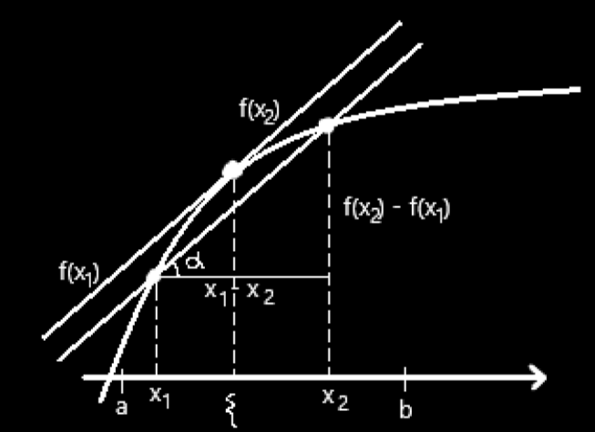

# ЛЕКЦИЯ 9

## Теорема о производной обратной функции

⭐ Для дифференцируемой функции с производной не равной нулю производная обратной функции - обратное значение производной.

Доказательство:

$(f^{-1} \circ f) (x)$              $y = f(x)$

$1 = (f^{-1})'_y \cdot f'_x$

$(f^{-1})'_y = \frac {1} {f'_x}$   .

## Производная высших порядков

$f''(x) = (f'(x))'$

$f^{(n)}(x) = (f^{(n-1)}(x))'$ — n-ая производная функции $f(x)$.

Пример:  $\sin^{(3)}(x) = - \cos x$

---

$(f(x) + g(x))^{(n)} = f(x)^{(n)} + g(x)^{(n)}$

## Формула Лейбница

$(f\cdot g)^{(n)} = \sum\limits_{k=0}^{n}C_n^kf^{(n-k)}g^{(k)}$

$C^k_n = \frac {n!} {k!(n-k)!}$

---

> $p$  — это точка локального минимума (строгого локального минимума), если 
$\exists \space U \in \mathcal N(p)$ ,  т.ч.  $\forall x \in U \space \space \space f(x) \geq f(p) \space \space \space (f(x) > f(p))$.
> 

> Аналогично для локального максимума.
> 

> Локальные минимумы  $\bigcup$  Локальные максимумы = Экстремумы.
> 

## Лемма Ферма

⭐ Если $p$ — точка экстремума функции $f(x)$,  то либо $f$ в  $p$ не дифференцируема, либо $f'(p) = 0$.

Доказательство:

Пусть $f'(p) = \alpha > 0$.      $p$ — точка локального минимума.

$f(x) = f(p) + f'(p)(x-p) + o(|x-p|)$

$x - p = \varepsilon$

$f(x) = f(p) + \alpha \cdot \varepsilon + o(\varepsilon)$

Можно выбирать $\varepsilon$ таким образом, чтобы значение функции $f(x)$ в точке $p$ стало больше (или меньше) чем $f(p)$.  CONTR, т.к. в таком случае $p$   не является локальным минимумом.

## Теорема Ролля

⭐ Если вещественная дифференцируемая на $[a, b]$ функция $f(x)$, такая что $f(a) = f(b)$, то  $\exists \space \xi \in [a,b]$, т.ч. $f'(\xi) = 0$.

Доказательство:

По Теореме Вейерштрасса об экстремумах  $\exists \space p, q \in [a, b]$, т.ч.
 $f(p) \leq f(x) \leq f(q) \space \space \space \forall x \in [a, b]$ .

Если $f(p) = f(q)$, то $f(x) = const$. OK.

Если $f \neq const$, то $\xi$ совпадает либо с $q$ ,  либо с $p$ (из Т. Вейерштрасса).

По Л. Ферма $f'(\xi) = 0$ .

## Теорема Лагранжа

⭐ Пусть $f : [a, b] \longrightarrow \mathbb R$ — дифференцируемая функция. Тогда  
$\forall \space x_1, x_2 \in [a, b] \space \space \space \exists \space \xi \in [x_1, x_2]$ , т.ч. $f(x_2) - f(x_1) = f'(\xi) \cdot (x_2 - x_1)$.

Доказательство:

$\frac {f(x_2) - f (x_1)} {x_2 - x_1} = \tg \alpha$

$f'(\xi) = \tg \alpha$

$l(t) = f(x_1) + \large \frac {f(x_2) - f (x_1)} {x_2 - x_1} (t - x_1)$

$l(t = x_1) = f(x_1)$                    $l(t = x_2) = f(x_2)$

${|f(t) - l(t)|}_{t = x_1, \space x_2} = 0$.

$f(x_i) = l (x_i) \implies (f - l) (x_i) = 0, \space \space i = 1, 2$ .

По Теореме Ролля   $f - l$  на краях отрезка $[x_1, \space x_2]$ принимает нулевые значения. 

$f'_t = \large \frac {f(x_2) - f (x_1)} {x_2 - x_1}$   $\exists \space \xi$ ,   т.ч. $(f - l)' (\xi) = 0$.

## Теорема Коши

⭐ Если функции $f$  и  $g$ дифференцируемы на отрезке $[a, \space b]$   и 
$g'(x) \neq 0 \space \space \forall \space x \in [a, \space b]$ ,  то    $\exists \space \space \xi  \in [a, \space b]$

$\large \frac {f'(\xi)} {g'(\xi)} = \frac {f(b) - f (a)} {g(b) - g(a)}$.

Доказательство:

Рассмотрим функцию $\phi(x) = f(x) + \lambda g(x)$.  $\lambda$  выберем так, чтобы  $\phi (a) = \phi (b)$ .

$f(a) + \lambda g(xa) = f(b) + \lambda g(b)$

$\lambda = - \large \frac {f(b) - f(a)} {g(b) - g(a) \tiny \neq 0}$ 
По Теореме Ролля $\implies \space \exists \space \xi \in [a, b]$ ,  т.ч.
$\phi ' (\xi) = 0$      $= \large {\frac {f'(\xi)} {g'(\xi)}} = \large {\frac {f(b) - f(a)} {g(b) - g(a)}} \small g'(\xi)$

$\large {\frac {f'(\xi)} {g'(\xi)}} = \large {\frac {f(b) - f(a)} {g(b) - g(a)}}$.

> Обозначение
$f|^b_a = f(b) - f(a)$    —   приращение функции $f$ на отрезке $[a,b]$ ( от $a$  до  $b$).
> 

## Лемма

⭐ Если функция  $g$ непрерывна на отрезке $[a, \space b]$   и 
$g'(x) \geq 0$   на $(a, \space b)$ ,  то   $g|^b_a \geq 0$.

$g|^b_a = \int^b_a g'(x)dx$.

Доказательство:

Из Теоремы Лагранжа следует, что
$g(x) \leq g(y) \space \space \forall x , y \in (a, b)$ 
$x \searrow a , \space \space y \nearrow b$              $g(a) \leq g(b)$

$g|^b_a = g(b) - g(a) \geq 0$

## Теорема о приращениях

⭐ Если $g$ и $h$  непрерывны на отрезке $[a, \space b]$   и 
$\forall \space t \in [a, b] \space \backslash \space \{a_1, ..., a_n\}$       $|f'(t)| \leq h'(t)$

Тогда  $|\space f|^b_a \space | \leq \space h|^b_a$

Доказательство:

Рассмотрим интервал $(a_i, a_{i+1})$:
$-h'(t) \leq f'(t) \leq h'(t)$
$g = h - f$  по предыдущей Лемме.        $\forall \space t \in (a_i, a_{i+1}) \space \space \space \space g|^{a_{i+1}}_{a_i} \geq 0$
$g|^b_a = \sum g|^{a_{i+1}}_{a_i} \geq 0$

$\large {-h|^b_a \leq f|^b_a \leq g|^b_a}$.
