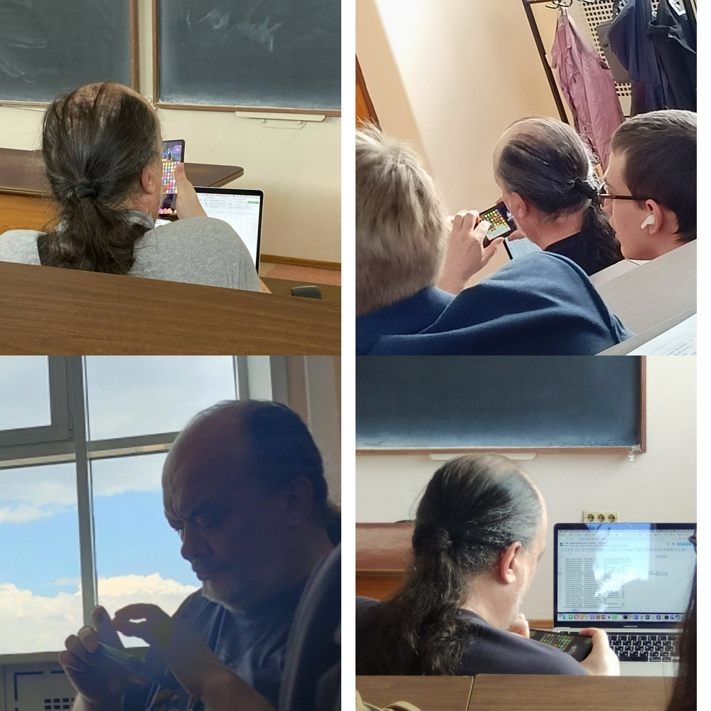

# Гайд по подключению процессора в Logisim

## ВВЕДЕНИЕ

Что же, начнем, на мой взгляд, разбор самой сложной темы на первом курсе. Но не пугайтесь такого прозвища раньше времени: я ее так называю, потому что именно подключение процессора вызывало больше всего вопросов у огромного числа людей.

Честно говоря, если хоть немного разобраться в этом, то в подключении нет ничего трудного, но так уж сложилось, что преподаватель, ответственный за разработку данного процессора и объяснение студентам его подключения (Иртегов) – ленивый скуфедрила, которого не интересует ничего кроме всевозможных вариантов игр «3 в ряд». По идее, он будет вести вам несколько лекций, связанных с проектом, во втором семестре, но поскольку ради этого нужно отрываться от телефона с игрушками, Иртегов будет говорить себе под нос, и никто не сможет нормально его расслышать. Мне известно всего два человека, которые его слушали, остальные либо бездельничали на лекциях, либо засыпали под его бубнение. Кстати, изначально этот гайд должен был писать как раз один из слушателей Иртегова, и он даже обещал вам расписать целых семь способов подключения процессора, но… ему стало лень.

Итак, поехали!

## ОСНОВНАЯ ЧАСТЬ

Думаю, первый вопрос, который вас мучает: «И где мне взять этот гребаный процессор? Первый ответ в гугле ничего не показывает. Мне что, его самому собирать из транзисторов?»

Так вот, нет, вам не надо так извращаться, достаточно открыть гугл классрум, в который вас добавил Назаров, там идете во вкладку «Задания», ищем «CdM8-Mark5» и оттуда скачиваем CdM8-mark5 -reduced или -full. В чем отличия? Теоретически, в full версии должны работать прерывания (это когда работа процессора можно в любой момент остановить, чтобы, например, получить какие-то внешние данные), но, как я уже говорил, Иртегов – ленивый скуфедрила, поэтому прерывания там то ли не работают вообще, то ли работают со странными багами, так что я вам использовать full версию не рекомендую. Впрочем, вы скоро заметите, что у него даже глаза работают только попеременно, так что с какой-то стороны его можно понять) Нет, конечно вы можете попробовать сделать за Иртегова его работу и заставить прерывания функционировать, и так даже уже некоторые люди делали, но, честно говоря, я понятия не имею какую вы хотите написать программу, чтобы там требовались прерывания, у нас на курсе, по-моему, они вообще никому не были нужны.

Теперь про reduced это тот же самый full только с вырезанными прерываниями, все. В принципе, вы можете работать на full версии, не трогая входы «IRQ», «vec» и «IAck», но это затратнее по ресурсам (а вы скоро поймете, что оптимизация очень необходима логисиму).

Теперь про само подключение, импортируете скачанный файл как библиотеку в ваш проект и используете схему «CdM_8_mark5».

Далее, самое важное, выходы из этой схемы:

- Способ 1
    
    В общем:
    
    - memory == 1 когда мы обращаемся к ПЗУ и ОЗУ (почти всегда)
    - data/ins' == 1 когда обращаемся конкретно к ОЗУ
    - read/write' == 1 когда нужно прочитать из ОЗУ (когда записать в ОЗУ == 0)
    
    В частности:
    
    - Выход memory == 0 только при выполнении команды halt, иначе всегда 1
    - При выполнении команды ld: data/ins’ == 1, read/write’ == 1
    - При выполнении команды st: data/ins’ == 1, read/write’ == 0
    - В остальных случаях: data/ins’ == 0, read/write’ == 1
    
    В принципе, уже основываясь только на этом вы можете подключить процессор, просто используя «И» или мультиплексоры, но вот вам картинка:
    
    
    
    Конечно, тут есть куча непонятных для вас входов/выходов, это из-за того, что я прикрепил меньше половины схемы, но ведь должны же вы и сами слегка подумать?
    
    Да, кстати, если вы подключите все ровно, то вам не нужно будет никак извращаться с самим ассемблерным кодом, и все будет спокойно работать как в Коколде (CocoIDE).
    
    Будем считать, что первый способ я вам рассказал)
    
- Способ 2
    
    Теперь по второму: открывайте святую книжку tome.pdf (гугл классрум -> все материалы курса -> tome.pdf), открывайте страницу 249 (239 на бумаге) и наслаждайтесь чудесным техническим английским авторов этого «максимально не устаревшего» курса. Все, вы все познали)
    
    
    
    Ладно-ладно, я не Бондарев (надеюсь, он вам все же будет вести семинары, а то вы не познаете этого чудесного человека, это большое упущение)), поэтому можете идти прямо на страницу 251 и копировать оттуда схему, еще, она же должна быть в тестовых схемах, идущих в одном файле с самим процессором, и там она точно рабочая.
    
    Зачем же я вам рассказывал предыдущий способ, если все уже есть готовое?
    
    Нууу, во-первых, если вы прогоните тестовую схему несколько раз, то скорее всего увидите, что там время от времени появляются красные проводки во время работы (кто не знает, так в логисиме показывается короткое замыкание (а возможно, если вы попробуете обмануть систему и создать какую-то бешенную хрень (для меня этим стал собственноручно сделанный тактовый генератор), провода станут оранжевыми, все **встанет,** и логисим **возбудится**… буквально)). Мало того, что так быть не должно и скорее всего вас будет **долбить** за это семинарист, не взирая на то, что это решение, предоставленное лектором, так большое количество красных проводов понижает стабильность работы логисима, а вы скоро узнаете, что стабильности работы этой шайтан-машины вам будет вечно не хватать (я подозреваю, что логисим писал такой же халявщик как Иртегов). Во-вторых, для такого варианта подключения придется изменять саму программу в ассемблере, чтобы все хорошо работало, а для этого снова изучать какой-то материал на английском, чего никому не хочется.
    
    
    
    Кстати про стабильность, это я просто неудачно запустил проект. Перезаход, скорее всего, все решит.
    
    Но можете свободно пользоваться, если вас не отпугнуло мое предупреждение)
    

## ЗАКЛЮЧЕНИЕ

Теперь вы знаете о том, как подключать процессор в логисиме, ответственность за это знание нынче лежит на вас

P.S. Вы загружаете не саму программу в логисим, а ее образ. Для этого необходимо в Коколде скомпилировать свою программу, а затем нажать на Save Mem Image в правом верхнем углу и сохранить полученный .img файл. После вы идете в логисим, нажимаете на ПЗУ, в котором будет храниться ваш код (тот, с которым взаиможействует процессор), в левом нижнем углу жмете справа от полоски содержимое, а там на «Открыть», после просто закрываете окно и радуетесь.

Инструкция в картинках для самых одаренных:

Коколд:

Логисим:

P.P.S. Высказываюсь здесь, так как больше негде) Имейте в виду, что создатель логисима – какой-то альтернативно одаренный человек, который не только не может написать ровный код, чтобы большие схемы работали нормально и их не приходилось перезапускать по несколько раз, но еще и не знает элементарный школьный курс физики, в частности – определение частоты. Чтобы вы понимали, встроенный измеритель частоты в логисиме считает не настоящую (цикл 0-1-0 как один Герц), а половинчатую, то есть 0-1 или 1-0 как один Герц. Просто знайте и делите показываемую логисимом частоту на два.

P.P.P.S. Мы надеемся, что хотя бы на вашем курсе найдется группа, которая сделает игру «3 в ряд», чтобы хоть единожды Иртегов отвлекся от телефона во время защиты проектов. Не подведите нас, пожалуйста)

                                                     ^ Это наша защита проектов ^

P.P.P.P.S.) Не забывайте про антиплагиат, на процессоры отдельно он тоже должен распространяться)

**© ~~Джейсон Стетхем~~ Фатеев Юрий**